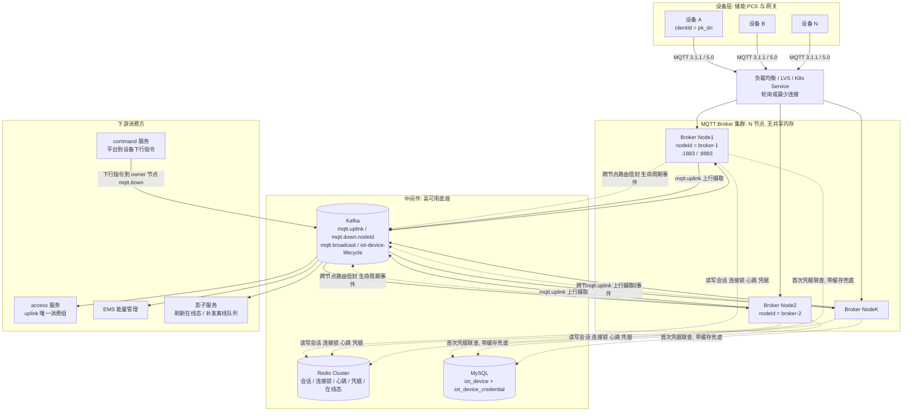
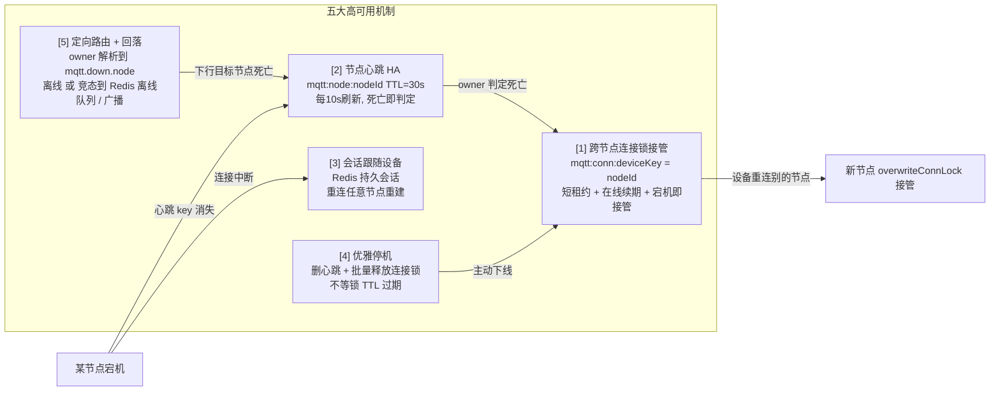
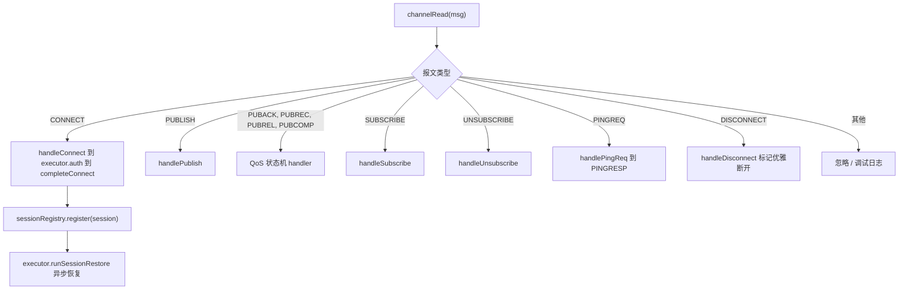
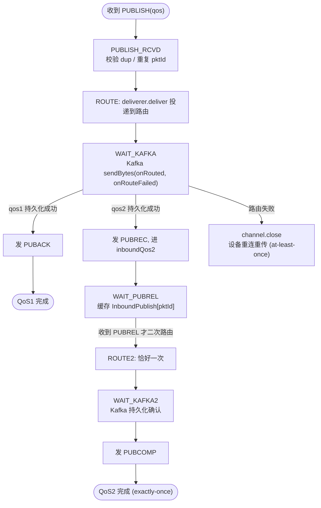
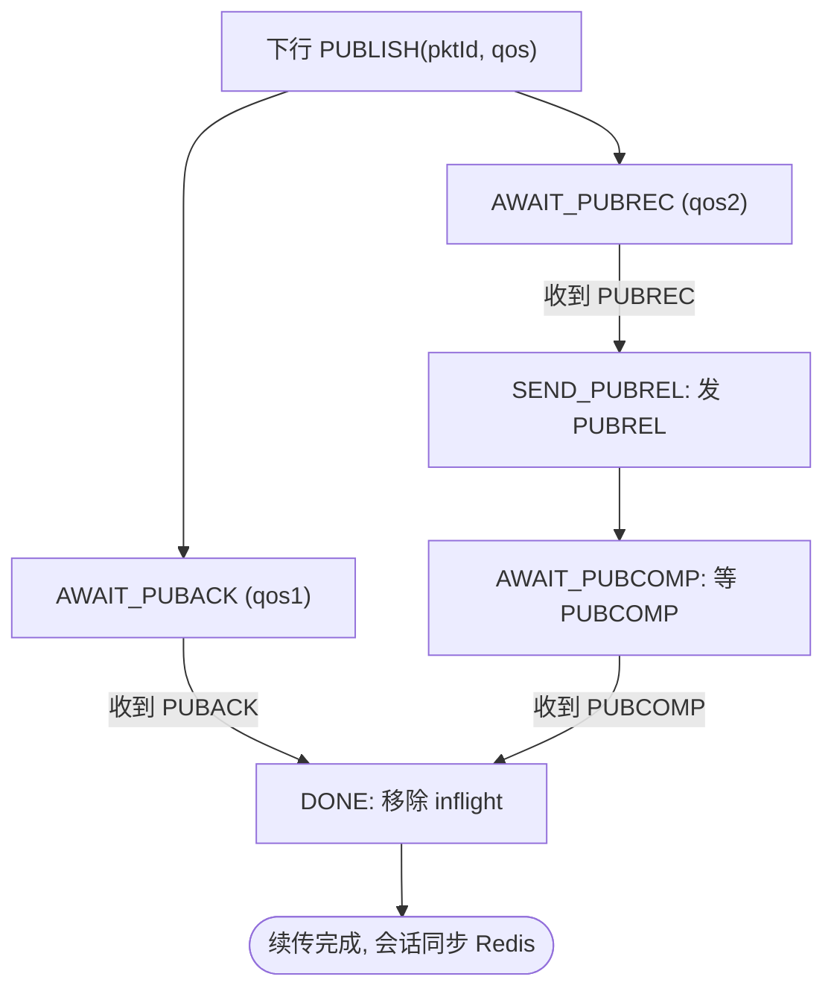
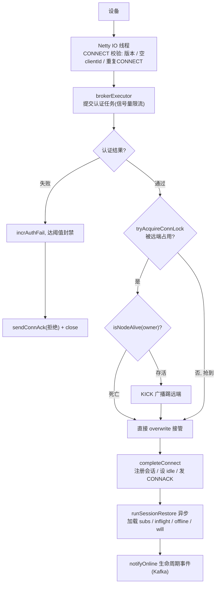
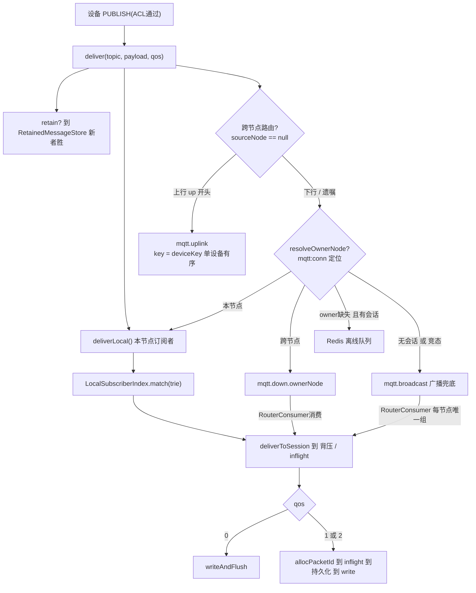
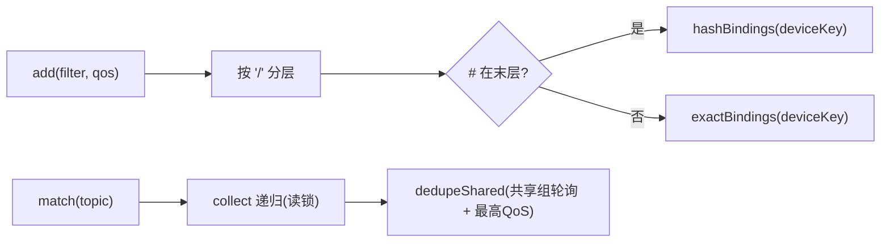
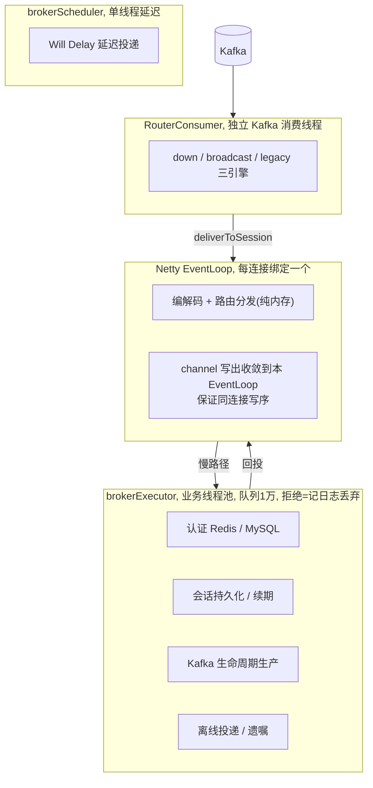
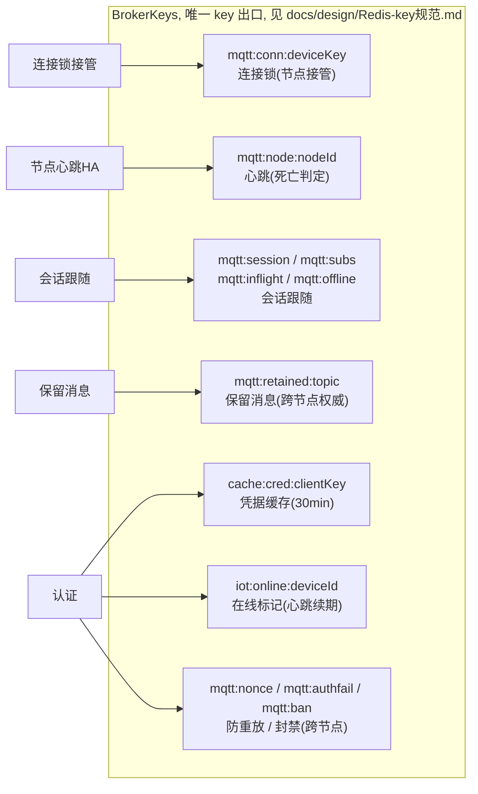

# Energy Storage IoT Platform · MQTT Broker 架构与高可用设计（面试速学）

> 适用对象：`energy-mqtt-broker` 模块（自包含，不依赖其他业务模块，通过 Kafka topic 与上下游交互）。
> 阅读顺序建议：①整体架构 → ②高可用总览 → ③关键代码设计（协议分发 / QoS 状态机 / CONNECT / 投递路由 / 订阅匹配 / 线程模型）→ ④Redis 与高可用关系 → ⑤容量与契约。
> 所有结论均来自源码（`backend/energy-mqtt-broker/src/main/java/com/energyx/broker/**`），可对照阅读。

---

## 1. 整体架构（部署拓扑）

设备经负载均衡打到 Broker **集群**中的任一节点；节点间**无状态共享内存**，全部通过 **Redis（会话/锁/心跳/凭据/在线态）** 与 **Kafka（跨节点路由/生命周期事件）** 协同，做到"会话跟随设备、连接可任意接管"。



**设计要点**
- Broker 节点本身是**无状态**的：内存只放"热 Session"（一个连接一个 `Session`）。任何可重建的持久态（订阅 / inflight / 离线队列 / 遗嘱 / 在线标记）都在 Redis。
- 设备重连被 LB 打到**任意**节点，都能从 Redis 重建持久会话 → **"会话跟随设备"，天然支持水平扩容**。
- 跨节点投递不靠节点间直连，统一走 Kafka topic，避免网状依赖。

---

## 2. 高可用总览（如何做到高可用）



**逐项说明**

| # | 机制 | 关键实现 | 故障处理 |
|---|------|----------|----------|
| 1 | 连接锁接管 | `SessionStore.tryAcquireConnLock`（SETNX，TTL=20s）；`refreshConnLockIfOwner` 随在线续期；`overwriteConnLock` 接管 | owner 心跳消失→跳过无效 KICK 直接 overwrite；否则发 KICK 踢远端 |
| 2 | 节点心跳 | `NodeHeartbeatScheduler` 每 10s 写 `mqtt:node:{nodeId}`（TTL=30s） | access 侧解析下行 owner 时若心跳缺失 → 判定死节点 → 回落广播/离线队列 |
| 3 | 会话跟随 | `SessionStore` 持久化 subs/inflight/offline/will 到 Redis | 设备重连任意节点 → `runSessionRestore` 加载订阅、续传 inflight、补发离线队列 |
| 4 | 优雅停机 | `MqttBrokerServer.stop()` 关 acceptor→发 DISCONNECT(0x8B)→停消费→停 producer→关池；`NodeHeartbeatScheduler.stop()` 删心跳+批量释放锁 | 其他节点立即接管，不等 20s 锁 TTL |
| 5 | 定向路由 | `MessageDeliverer.routeDirectedSlow` 用 `resolveOwnerNode` 定位设备所在节点，发 `mqtt.down.{nodeId}`；owner 缺失→离线队列；无会话→广播 | 死节点不再收到定向消息，规避"无人消费的分区" |

---

## 3. 关键代码设计

### 3.1 协议报文分发（事件循环零阻塞）

`MqttChannelInboundHandler.channelRead` 是唯一入口，按 `MqttMessageType` 分发。阻塞操作（认证/锁/持久化）一律经 `brokerExecutor` 剥离，最终会话注册与 CONNACK 回投 IO 线程。



### 3.2 QoS1/2 上行状态机（PUBLISH → PUBACK/PUBCOMP 在 Kafka 持久化确认后）

**可靠性契约**：QoS1/2 上行的 `PUBACK` / `PUBCOMP` 仅在 Kafka 路由**持久化回调成功**后才发送；路由失败则关连接，设备重连重传（at-least-once）。



- **QoS2 入站"恰好一次"**：`inboundQos2` 缓存，收到 `PUBREL` 才路由（保证恰好一次语义）；重复 `PUBREL` 直接回 `PUBCOMP`（幂等）。
- **QoS2 出站"恰好一次"**：见 3.3。

### 3.3 QoS1/2 下行状态机 + inflight 续传（断线重连不丢）

`Session.outboundInflight` 缓存待确认报文；持久会话同步到 Redis `mqtt:inflight`，重连后 `resendInflight` 按状态续传。



断线重连续传：AWAITING_PUBACK 重发 PUBLISH(dup)；AWAITING_PUBREC 重发 PUBLISH(dup)；AWAITING_PUBCOMP 按原 pktId 重发 PUBREL。

### 3.4 CONNECT 处理流程（认证 → 连接锁 → 会话恢复）



### 3.5 消息投递路径（本地 + 跨节点定向路由）



**路由通道（阶段 2 定向模型）**
- `mqtt.uplink`：设备上行，key=deviceKey（单设备有序），仅 access 唯一消费组摄取。
- `mqtt.down.{nodeId}`：平台/跨节点下行，按连接锁 owner 定向，仅目标节点消费。
- `mqtt.broadcast`：KICK 踢线 / owner 缺失回落，每节点唯一消费组全量 fan-out + sourceNode 去重。
- `mqtt.router`（兼容期）：仅 `router-legacy-broadcast=true` 启用，全量升级后关闭删除。

### 3.6 订阅匹配（topic trie，O(层级数)）

`LocalSubscriberIndex` 用分层 trie 替代 O(N) 线性扫描，支撑 50 万级订阅：
- `+` 单层级通配；`#` 锚定在所在层级（`hashBindings`）；共享订阅 `$share/{group}/{filter}` 组内轮询选一（QoS 取组内最大）。



### 3.7 线程模型（性能与稳定基石）



**铁律**：Netty EventLoop 上禁止任何 Redis/MySQL/Kafka 同步阻塞调用；所有慢路径走 `brokerExecutor`。拒绝策略是"记日志丢弃"而非 `CallerRunsPolicy`（后者会让 IO 线程内联执行阻塞任务，卡死整个 EventLoop）。

---

## 4. Redis 与高可用关系



**Lua 原子脚本**（`SessionStore`）保证并发安全：`PUSH_OFFLINE`（RPUSH+LTRIM+EXPIRE 单 RTT）、`POP_OFFLINE`（LRANGE+DEL 避免新消息误删）、`RELEASE_LOCK`（GET==owner 才 DEL）、`REFRESH_LOCK`、`INCR_AUTH_FAIL`、`SET_RETAINED_IF_NEWER`（新者胜，防时钟漂移覆盖）。

---

## 5. 容量目标与安全契约（面试常问）

**容量目标**（Phase 1）：单节点 25 万连接 / 5 万 msg/s；集群 100 万连接；跨节点路由 P99 ≤ 10ms。

**认证契约**（设备 SDK 必须遵循）：
```
clientId  = {productKey}_{deviceName}
username  = {clientId}&{timestamp}&{nonce}
password  = hex( HMAC-SHA256(deviceSecret, username) )
```
- `timestamp` 毫秒，±2min 窗口；`nonce` 经 Redis SETNX 一次性消费（5min TTL）防重放。
- 连续失败 ≥10 次 → `mqtt:ban:{clientId}` 封禁 300s（跨节点共享，自然过期解封）。
- mTLS（P1-12）：客户端证书 CN 必须等于 clientId。
- Topic ACL：`canPublish` 仅限本设备 `up/{type}`、`ota/{type}`；`canSubscribe` 仅限本设备 `down/*`、`ota/down`（支持 `$share` 前缀）。

**优雅停机顺序**：关 acceptor → MQTT5 发 DISCONNECT(0x8B) → 停 RouterConsumer → 停 KafkaProducer(flush) → 关业务线程池；`NodeHeartbeatScheduler.stop()` 删心跳 + 批量释放本节点连接锁，让其他节点立即接管。

---

## 6. 三十秒速记（面试电梯陈述）

> "我们的 MQTT Broker 是**无状态节点 + Redis/Kafka 状态外置**的集群架构。高可用靠四件事：①**跨节点连接锁**（Redis SETNX 短租约，宕机即接管，避免同 clientId 双连接）；②**节点心跳**（30s TTL，死节点被判定后下行回落广播/离线队列）；③**会话跟随设备**（订阅/inflight/离线队列全在 Redis，重连任意节点重建）；④**优雅停机**（删心跳+批量释放锁，不等 TTL）。可靠性靠 QoS 状态机：QoS1/2 的 PUBACK/PUBCOMP **必须等 Kafka 持久化确认**才回，失败关连接让设备重传（at-least-once）；下行 inflight 持久化支持断线续传。性能靠**线程模型铁律**——EventLoop 零阻塞，所有慢路径剥离到业务线程池，拒绝策略丢弃而非内联执行。"
