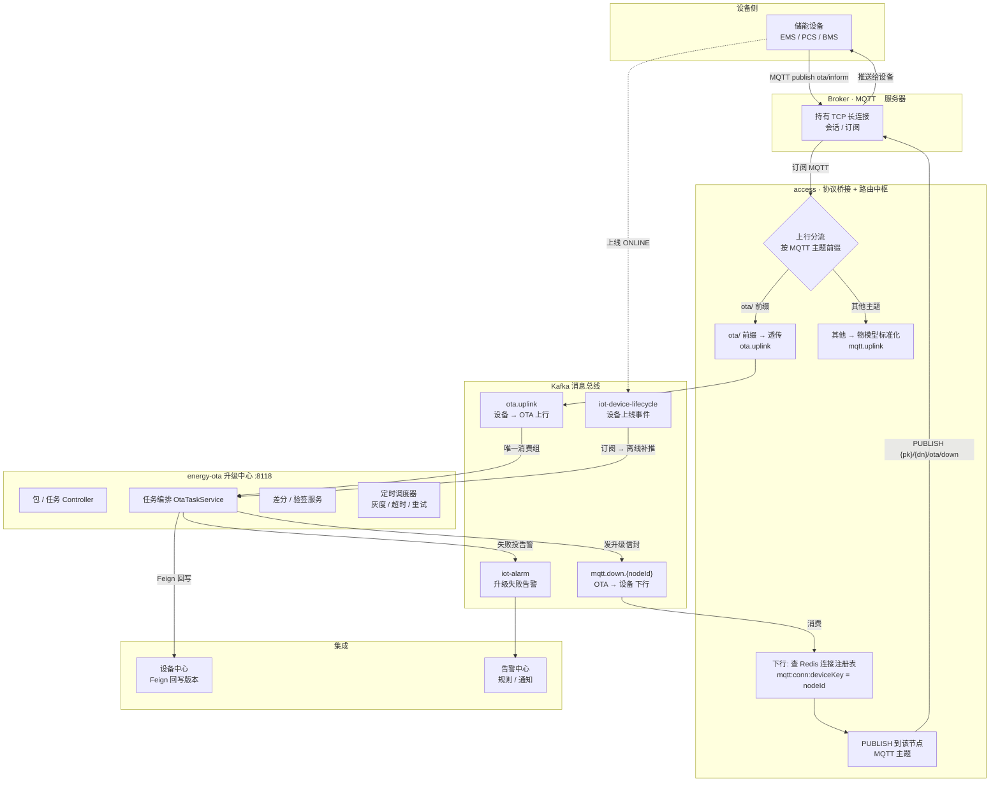
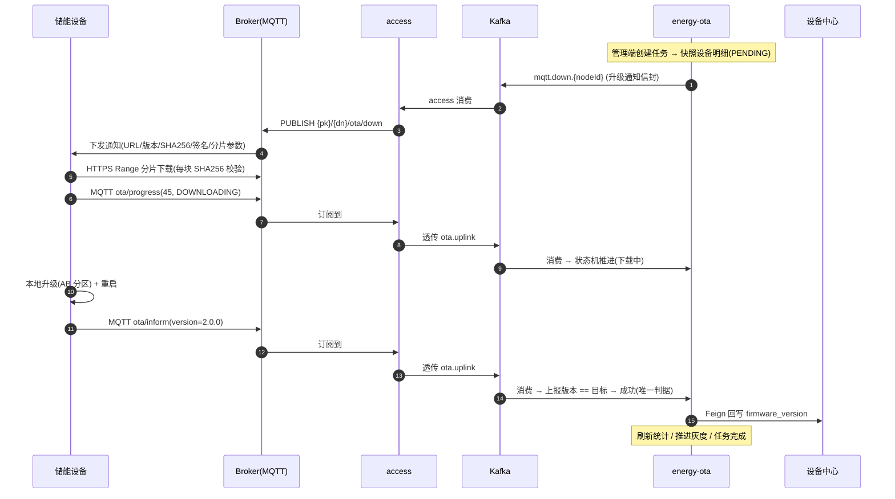
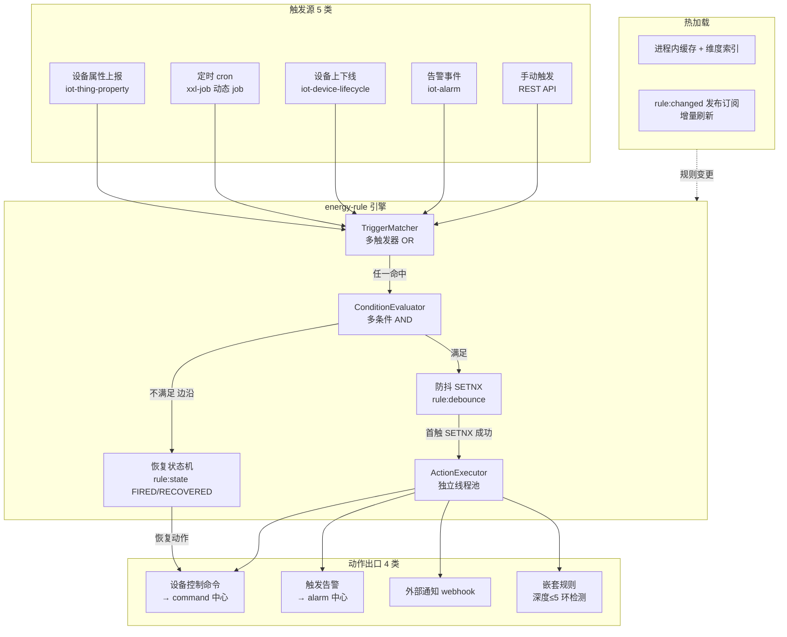
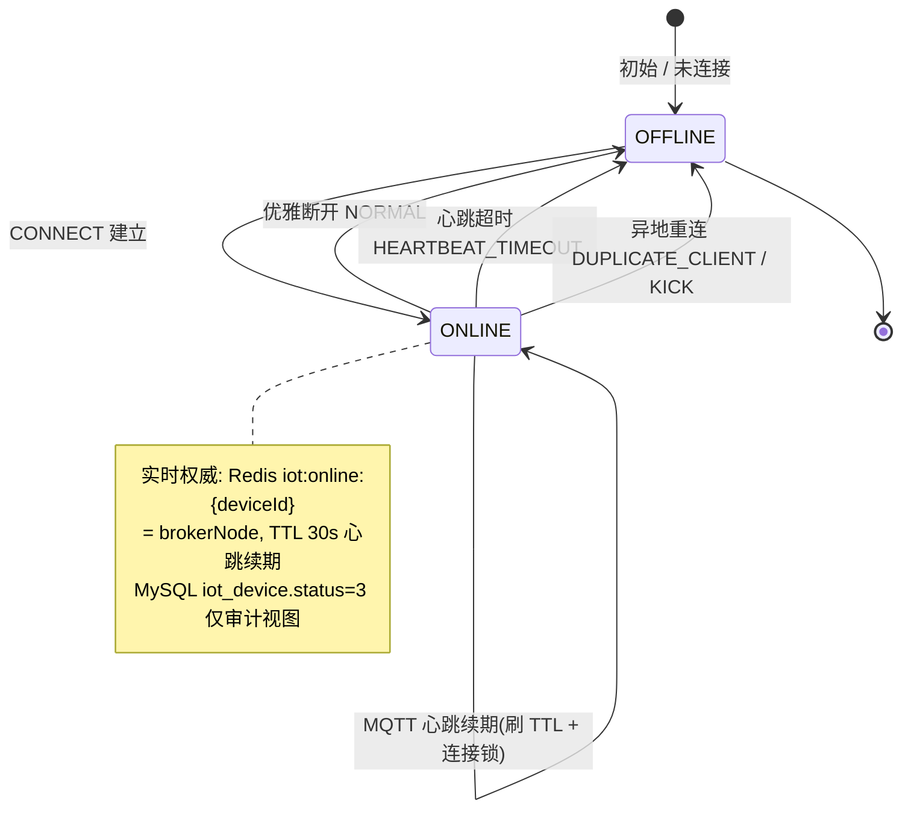
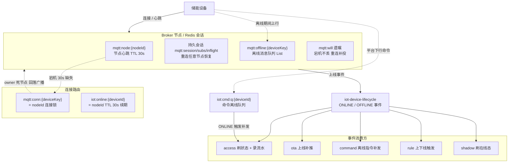

# EnergyX OTA 升级中心 — 架构与流程图解（面试用）

> 核心一句话：Kafka 是控制面消息总线，把「升级中心 OTA」与「设备接入层（Broker + access）」彻底解耦。
> 两套 topic 体系：Kafka topic（服务间）与 MQTT Broker topic（设备侧），由 access 桥接翻译。

---

## 1. 分层拓扑总图

---

## 2. 端到端时序图（在线设备主流程）

---

## 3. 关键考点速记

- **两套 topic**：Kafka topic（ota.uplink / mqtt.down.{nodeId} / iot-device-lifecycle / iot-alarm）是服务间总线；MQTT topic（ota/inform、{pk}/{dn}/ota/down）是设备侧。access 负责翻译。
- **access 是中间人**：上行按 MQTT 主题前缀分流（ota/ 旁路到 ota.uplink，其余标准化到 mqtt.uplink）；下行按 Redis 连接注册表 mqtt:conn:{deviceKey}=nodeId 找到设备所在 Broker 节点，PUBLISH 到该节点 MQTT 主题。
- **Broker ≠ access**：Broker 是 MQTT 服务器（管连接），access 是桥接/路由应用（管 Kafka↔MQTT 翻译）。
- **成功判据**：设备上报新版本号 == 目标版本（同阿里云），进度 100% 但没上报新版本且超升级超时 → 判失败。
- **离线兜底**：下行查不到 owner → 回落 mqtt.broadcast + 明细保持 PENDING；设备上线触发 iot-device-lifecycle → 补推（双保险）。
- **差分**：DIFF_FIRST 策略按设备当前版本匹配差分包，未命中自动退化全量；双 SHA256 校验（差分包自身 + 合并产物 == 全量包）。
- **灰度**：1%→10%→50%→100%，本批成功率 <95% 且开启自动暂停 → 暂停任务 + 告警。

---

## 4. 场景联动（规则引擎）架构图

---

## 5. 设备在线 / 离线状态机（弱网容错）图

### 5.1 在线状态机

### 5.2 弱网 / 离线容错架构

---

## 6. 关键考点速记（场景联动 + 设备状态）

- **场景联动 = TCA 模型**：Triggers[] 是 OR（5 类触发源）、Conditions[] 是 AND、Actions[] 独立执行（4 类动作 + 嵌套规则）。
- **防抖 + 恢复**：SETNX 防高频轰炸；recovery 做边沿触发（满足→不满足时执行恢复动作，不受防抖限制）。
- **热加载不重启**：进程内缓存 + 维度索引，规则变更双写 MySQL + 发 `rule:changed` 发布订阅增量刷新。
- **解耦**：动作只构造请求，设备命令下沉命令中心（幂等/超时/重试/离线队列）、告警下沉告警中心；规则引擎自己只做编排。
- **定时触发用 xxl-job**：动态注册 job（jobKey=rule-{ruleId}），多实例靠 `lock:scheduled:rule-{id}` 分布式锁防重。
- **设备状态双权威**：实时在线态权威在 Redis `iot:online:{deviceId}`（心跳续期 TTL 30s，规则/条件读它）；MySQL `iot_device.status` 仅审计视图。
- **离线/弱网判定的关键**：Broker 连接权威 + MQTT keepalive 超时（HEARTBEAT_TIMEOUT）识别静默断连，不依赖 TCP FIN。
- **弱网不丢的三层**：持久会话（session/subs/inflight 存 Redis，重连任意节点恢复）+ 离线消息队列 `mqtt:offline` + 命令离线队列 `iot:cmd:q`（上线事件触发补发）。
- **死节点规避**：节点心跳 `mqtt:node:{nodeId}` TTL 30s，宕机后 `BrokerNodeResolver` 判死节点 → 下行回落广播/离线队列；优雅停机删心跳 + 释放连接锁让其他节点立即接管。

