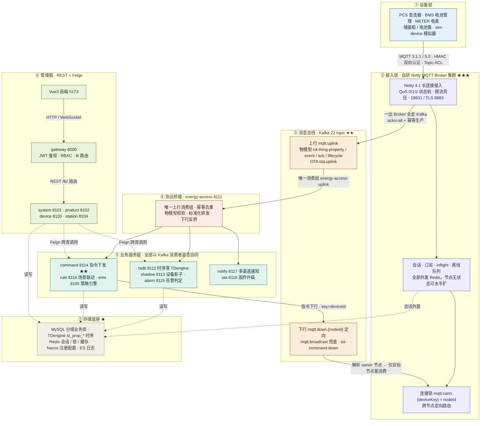
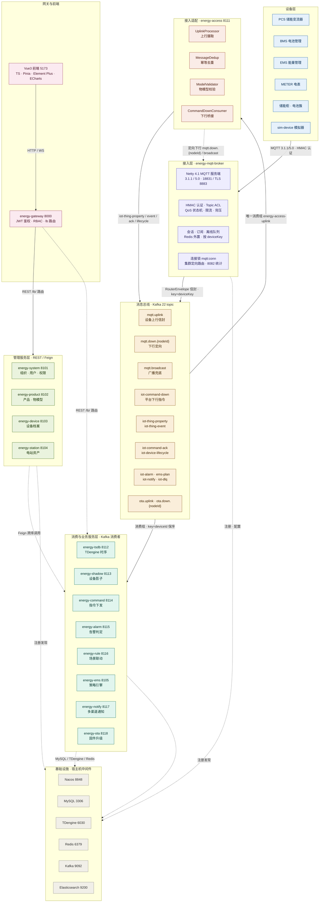
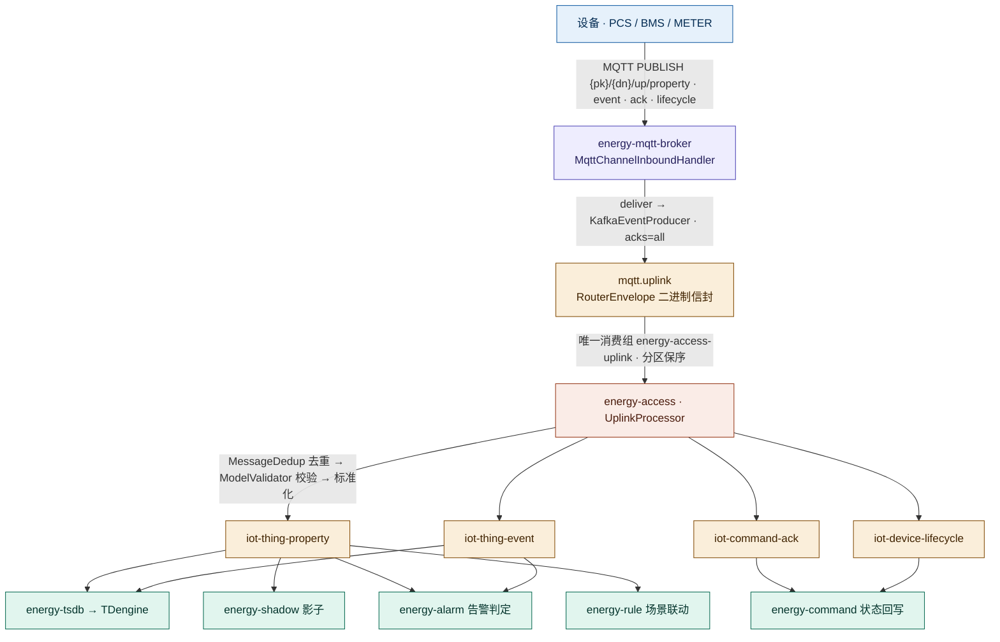
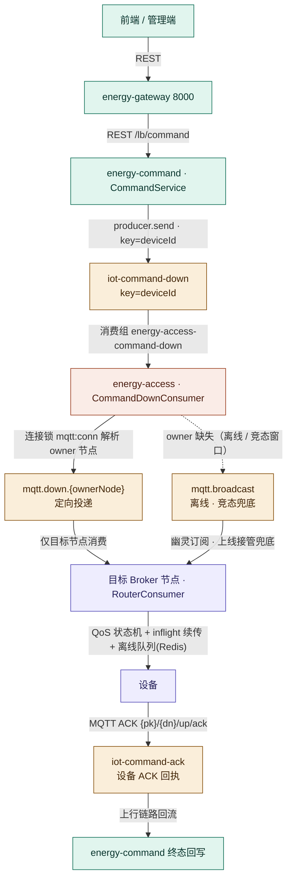
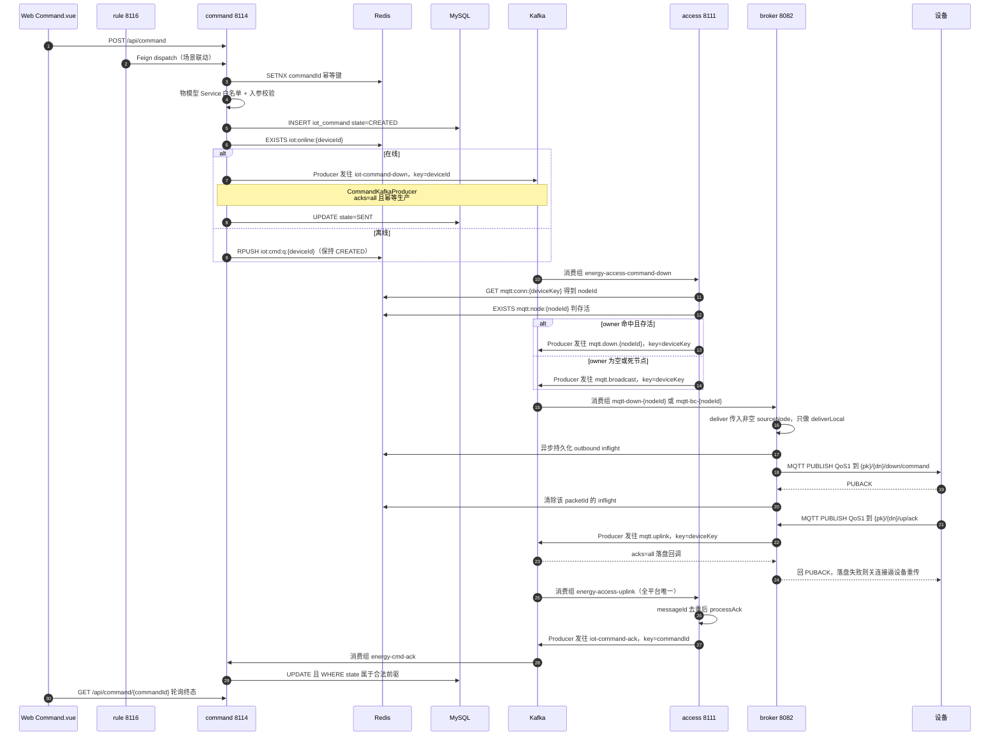
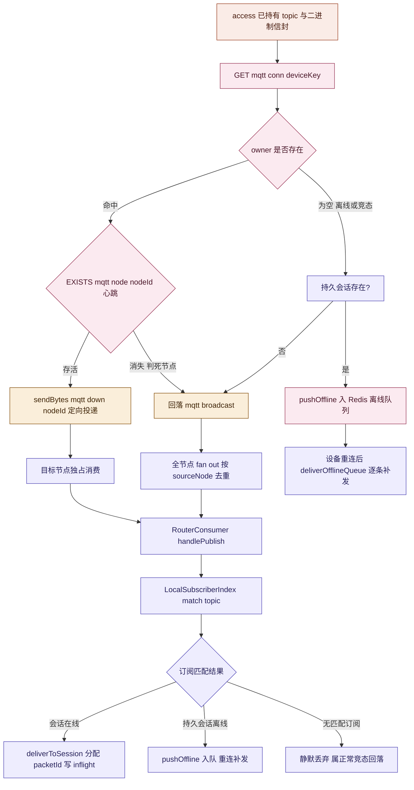
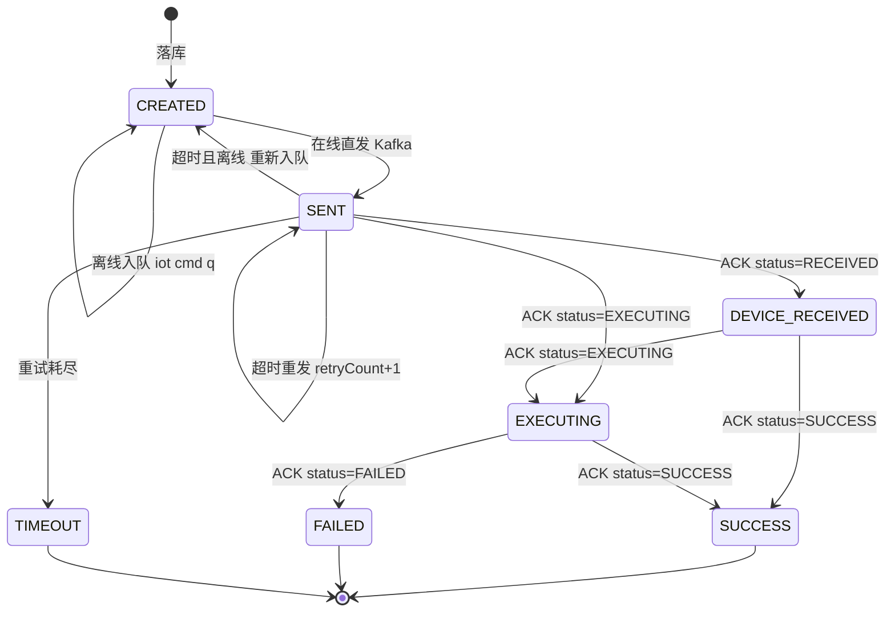
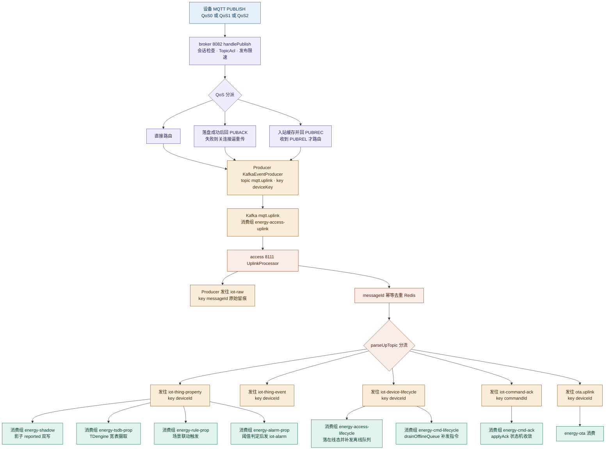

# EnergyX 储能管理平台（EMS）

面向新能源储能行业的企业级 IoT + EMS 平台。覆盖 集团→企业→电站→储能柜→电池簇→PCS→BMS→电芯 全链路资产管理，支持百万级设备接入、多租户、云边协同与 AI 能源优化。

自研 MQTT Broker 集群负责设备接入，**消息一出 Broker 全走 Kafka 事件总线**，后端服务（tsdb/shadow/alarm/command/ems/rule/notify/ota）全部以 Kafka 消费者身份协同，业务 CRUD 走 REST 网关 + Feign 跨库调用。

---

## 面试演示 · 一页纸架构图

> **怎么用这张图**：14 个节点、7 层、带 ①→⑦ 讲解动线，★ 是亮点锚点（面试官大概率顺着问下去）。
> **白板可复现性**：7 条横线分出层次 → 每层填 1~3 个框 → 连上「④→⑤ 上行」和「⑤→③→② 下行」两条闭环。3 分钟能徒手画完。
> **要细节时**跳下一节 [平台架构 · 详细全景版](#平台架构--详细全景版对照代码用)（30+ 节点，含全部 Kafka topic、消费组、Redis key）。



**一句话主线**：设备 MQTT 上报 → Broker 收下即刻丢进 Kafka → access 唯一消费组摄取并标准化 → 各业务服务按自己的消费组各取所需 → 下发指令时反向走「查连接锁 → 定向 topic → 目标 Broker 节点 → MQTT 到设备」，ACK 再经上行链路回流闭合。

### 讲解话术（三档）

**30 秒 · 电梯版**

> 储能 IoT + EMS 平台，我主要负责**设备接入和消息这条主线**。现场 PCS、BMS、电表通过 MQTT 长连接到我们**自研的 Netty Broker 集群**——这块是我从头写的，QoS 0/1/2 状态机、会话订阅全外置 Redis、节点无状态可水平扩。核心设计一句话：**消息一出 Broker 全走 Kafka**，MQTT 只负责「设备 ↔ Broker」这一段，后端 tsdb/shadow/alarm/command 全是 Kafka 消费者，谁也不订阅 MQTT 主题，接入层和业务层彻底解耦。下发指令时反过来，用 Redis 连接锁 `mqtt:conn:{deviceKey}` 查到设备挂在哪个节点，往 `mqtt.down.{nodeId}` 定向投递，只有目标节点消费得到。全平台 14 个微服务，管理面走网关 REST + Feign，数据面全走 Kafka 事件总线。

**1 分钟 · 分层展开版**（按 ①→⑦ 走一遍动线）

> ① 设备层是储能现场的 PCS、BMS、电表、储能柜，开发联调用自带的 `sim-device` 模拟器。
> ② 接入层是自研 Broker，除了长连接和 QoS，**关键是所有状态外置 Redis**——会话、订阅、inflight、离线队列全不在 JVM 里，所以节点无状态，挂了设备重连到别的节点就能恢复，这是能水平扩容的前提。
> ③ Kafka 是中枢，22 个 topic 分三类：Broker 路由、物模型事件、业务事件。
> ④ access 是唯一的协议桥，也是上行唯一的消费组——**单写者归一**，天然不重复。
> ⑤ 业务层八个服务各拿各的消费组，**同 topic 不同组 = 广播**，所以一条属性上报能同时喂给时序库、影子、告警、场景联动而互不影响。
> ⑥ 管理面是网关 + 四个档案服务，走 REST 和 Feign。
> ⑦ 存储是分层的：MySQL 存业务、TDengine 存时序、Redis 存会话和锁、ES 存日志。

**3 分钟 · 亮点深挖版**（挑 ★★★ 那块讲透）

> 最有技术含量的是**多节点集群下的下行定向路由**。设备连上来时，Broker 用 `SETNX mqtt:conn:{deviceKey} = nodeId` 抢连接锁并带 TTL 续期，节点自己每 10 秒刷 `mqtt:node:{nodeId}` 心跳（TTL 30 秒）。下发命令时，access 先 `GET` 到 owner 节点，再 `EXISTS` 判心跳是否存活：命中且存活 → 发 `mqtt.down.{nodeId}` 定向投递，只有那个节点的消费组收得到；owner 为空或节点已死 → 回落到 `mqtt.broadcast` 全节点 fan-out，靠 `sourceNode` 字段去重。
> 还有个容易踩的坑：**Broker 收到定向消息后必须传非空 `sourceNode`，只做本地投递不再转发**，否则两个节点互转就是投递环路。
> 可靠性上，上行是 at-least-once，靠三层防重兜底：Kafka 消费组互斥（并发不重复）、生产侧 `enable.idempotence + acks=all`（Broker 不制造重复）、消费边界 Redis SETNX 去重 + 业务条件更新（重放不重复）。下行再叠一个指令状态机和超时重发、离线补发。

### 追问锚点 · 应答索引

| 面试官可能问 | 对应图块 | 一句话要点 | 深挖文档 |
| --- | --- | --- | --- |
| 为什么自研 Broker，不用 EMQX / Mosquitto？ | ② ★★★ | 需要把连接锁、会话、定向路由和业务侧的 deviceKey 语义打通；自研可控且省License。已做过 EMQX 替代的三阶段评估 | [MQTT-Broker-架构与高可用.md](MQTT-Broker-架构与高可用.md) |
| 百万长连接怎么撑？瓶颈在哪？ | ② ★★★ | Netty EventLoop 内**禁止同步阻塞**，慢路径全丢业务线程池；会话外置 Redis 使节点无状态，扩容只需加节点 | [Phase4-自研MQTTBroker.md](docs/design/Phase4-自研MQTTBroker.md) |
| 怎么知道设备连在哪个节点？ | ② ③ | `mqtt:conn:{deviceKey}` = nodeId，SETNX + TTL 续期 + Lua 比较释放；`down.{nodeId}` 定向、`broadcast` 兜底 | [命令下发全链路与Redis定向路由.md](docs/design/命令下发全链路与Redis定向路由.md) |
| 节点挂了，它上面的设备怎么办？ | ② ③ | 优雅停机主动删心跳 + SCAN 释放锁；异常宕机则等 TTL 过期后设备重连接管；已知缺口是无主动接管扫描器 | [MQTT-Broker-架构与高可用.md](MQTT-Broker-架构与高可用.md) |
| 上行为什么只有一个消费组？不怕吞吐不够？ | ③ ④ | 单写者归一是为了幂等和保序；保序靠 `key=deviceKey` 分区，吞吐靠加分区 + 4 消费者线程 | [README 数据流](#数据流) |
| at-least-once 下重复消息怎么防？ | ⑤ | 三层防重：消费组互斥 / 生产幂等 / Redis SETNX 去重 + 业务条件更新（如 `WHERE state ∈ 合法前驱`） | [README 多实例重复防护](#多实例下的重复防护三层) |
| 指令发出去没回执怎么办？ | ⑤ command ★★ | 状态机 CREATED→SENT→…→SUCCESS/FAILED/TIMEOUT，超时扫描器在线重发、离线重入队、上线补发 | [README 指令状态机](#指令状态机与补偿mermaid) |
| 设备断线重连，QoS1 消息会丢吗？ | ② ⑤ | inflight 持久化在 Redis，重连后 `resendInflight` 重新分配 packetId 重发 dup PUBLISH；QoS2 已完成 PUBREC 的继续发 PUBREL | [Phase4-自研MQTTBroker.md](docs/design/Phase4-自研MQTTBroker.md) |
| 影子（shadow）和时序库（tsdb）什么区别？ | ⑤ ⑦ | 影子 = 设备**最新状态**（MySQL 版本乐观锁 + Redis Hash），时序 = **历史轨迹**（TDengine `st_prop_{pk}` 宽表），两者消费同一 topic 但互不影响 | [Phase6-业务模块.md](docs/design/Phase6-业务模块.md) |
| TDengine 为什么按产品分库？ | ⑦ ★ | `st_prop_{productKey}` 按产品建库，避免单超级表热点、跨产品查询互相干扰，也便于按产品做数据保留与清理 | [Phase2-数据库设计.md](docs/design/Phase2-数据库设计.md) |
| 场景联动怎么避免告警抖动？ | ⑤ rule | 规则求值后过防抖窗口 + 恢复边沿检测，只在状态真正翻转时触发动作 | [Phase11-场景联动与规则编排设计.md](docs/design/Phase11-场景联动与规则编排设计.md) |
| Nacos / 网关挂了会怎样？ | ⑥ ⑦ | Nacos 挂了不影响已建立的连接和 Kafka 消费（本地有缓存），只影响新服务注册与配置推送；网关只影响管理面，数据面不走它 | [Phase9-生产化差距分析.md](docs/design/Phase9-生产化差距分析.md) |

> 面试完整问答清单见 [docs/interview/面试问答-物联网平台-Java9年.md](docs/interview/面试问答-物联网平台-Java9年.md)；OTA 专项图解见 [OTA-面试图解.md](OTA-面试图解.md)。

---

## 平台架构 · 详细全景版（对照代码用）

> 30+ 节点的全景图，含全部 Kafka topic、消费组、Redis key。面试开场讲解请用上一节的一页纸版本。



| 层 | 职责 | 关键点 |
| --- | --- | --- |
| L1 设备层 | 储能全链路设备 | 真机或 `sim-device` 模拟器，HMAC 双向认证，`{pk}/{dn}/up/{type}` 主题约定 |
| L2 接入层 | 百万级长连接接入 | Netty 自研 Broker；QoS 0/1/2 状态机、限流背压、会话/订阅/离线队列全部外置 Redis；连接锁 `mqtt:conn:{deviceKey}` 支持多节点集群与定向路由 |
| L3 消息总线 | 全链路事件总线 | 22 topic 分三类：Broker 路由（mqtt.uplink / down / broadcast）、物模型事件（iot-thing-*）、业务事件（iot-alarm / ems-plan / ota.* / iot-notify / iot-dlq） |
| L4 接入适配 | Broker ↔ 业务的桥 | 唯一消费组摄取上行；幂等去重（Redis SETNX）、物模型校验、标准化转发；下行指令反向桥接为 MQTT |
| L5 消费与业务 | 平台核心能力 | 全部以 Kafka 消费者姿态消费物模型事件，互不阻塞；跨库数据经 Feign 按需回源 |
| L6 管理服务 | 基础档案 CRUD | system/product/device/station 四域独立库（MyBatis Plus 多模块重构），对外 REST |
| L7 网关前端 | 统一入口 | Gateway 统一鉴权（JWT 验签 + RBAC）+ `lb://` 路由 + WebSocket 实时推送 |
| L8 基础设施 | 宿主机中间件 | Nacos 注册配置、MySQL 业务库、TDengine 时序库（按产品分库 `st_prop_*`）、Redis、Kafka、ES 日志 |

---

## 数据流

> 这里是概览图。细到服务、Kafka topic、消费组、Redis key 的全链路版本见下方 [命令下发与数据上报 · 全链路详解](#命令下发与数据上报--全链路详解)。

**关键**：MQTT 只用于「设备 ↔ Broker」这一段；Broker 是「MQTT 接入 + Kafka 桥」一体，消息出了 Broker 全走 Kafka，后端服务全是 Kafka 消费者，**不订阅 MQTT 主题**。

### 设备上报（上行）



- **Broker 内部**：`MqttChannelInboundHandler` 完成 ACL / QoS 状态机 / 限流，`MessageDeliverer.deliver()` 先查本节点订阅（`deliverLocal`），再 `routeDirected()` 入 Kafka（幂等生产 `enable.idempotence + acks=all`）。
- **mqtt.uplink 唯一消费**：仅 energy-access 的 `energy-access-uplink` 组消费，无 fan-out，天然单写者归一。
- **OTA 命名空间**：`{pk}/{dn}/ota/{inform|progress|result|pull}` 由 access 透传到 `ota.uplink`，供 energy-ota 消费（固件升级独立于物模型链路）。

### 平台下发（下行）



### 多实例下的重复防护（三层）

1. **并发不重复**：同服务多实例共用同一 `groupId`，Kafka 消费组把分区互斥分配给组内成员——一个分区同一时刻只被一个实例消费（同组 = 分活干；不同组 = 广播，如 broker `mqtt-down-{nodeId}` 每节点一组是有意 fan-out）。
2. **Broker 不制造重复**：单条 MQTT 消息只入站一个 Broker 节点 + 生产侧幂等（`enable.idempotence` + `acks=all`）。
3. **重放不重复（at-least-once 兜底）**：崩溃/重连后的重发由各消费边界拦截——access/tsdb 用 `MessageDedup`（Redis SETNX，key=`iot:msg:dedup:{stage}:{device_id}:{message_id}`）；command/ems/alarm 用业务幂等（条件状态迁移、雪花唯一键、覆盖式 UPDATE）。

### 命令下发与数据上报 · 全链路详解

> 上面 [数据流](#数据流) 是概览图，这里展开到服务级：标注每一跳走 Kafka / MQTT / Redis 哪一种、谁是生产者谁是消费者、谁订阅谁，以及 Kafka 主题、消费组、key 与 Broker 的 MQTT topic 约定。文本图便于终端阅读，mermaid 图便于渲染查看，两者内容等价。

#### 命令下发（文本图）

```text
[Web Command.vue]                        [场景联动 rule 8116]
      │ POST /api/command                      │ Feign CommandClient.dispatch()
      └──────────────────┬─────────────────────┘
                         ▼  gateway 8000
                    command 8114
 ┌─────────────────────────────────────────────────────────┐
 │ CommandService.createCommand()                          │
 │  ① SETNX 幂等键 commandId            → Redis            │
 │  ② 物模型 Service 白名单 + 入参校验   → Feign product    │
 │  ③ INSERT iot_command state=CREATED  → MySQL            │
 │  ④ EXISTS iot:online:{deviceId}      → Redis(broker写)  │
 └───────────────┬─────────────────────────┬──────────────┘
            在线 ▼                          ▼ 离线
  Producer: CommandKafkaProducer        Redis RPUSH
  topic   : iot-command-down            key: iot:cmd:q:{deviceId}
  key     : deviceId                    状态保持 CREATED
  acks=all + 幂等生产                    等上线补发
             │
             ▼  Kafka topic: iot-command-down
  Consumer group: energy-access-command-down   (access 8111, 2 线程)
             │
             ▼  CommandDownConsumer → EventPublisher.publishRouterDown()
 ┌─────────────────────────────────────────────────────────┐
 │ 组 MQTT topic : {pk}/{dn}/down/command                   │
 │ 信封          : RouterEnvelopeCodec 二进制 (magic 0xE9)  │
 │ 定位          : GET mqtt:conn:{deviceKey} → nodeId       │
 │ 存活判定      : EXISTS mqtt:node:{nodeId}                │
 └──────────┬────────────────────────────┬─────────────────┘
   命中且存活▼                            ▼ owner 空 / 死节点
  Producer: AccessKafkaProducer       Producer: AccessKafkaProducer
  topic   : mqtt.down.{nodeId}        topic   : mqtt.broadcast
  key     : deviceKey                 key     : deviceKey
             │                                  │
             ▼                                  ▼
  Kafka: mqtt.down.{nodeId}           Kafka: mqtt.broadcast
  group : mqtt-down-{nodeId}          group : mqtt-bc-{nodeId}
  (仅目标节点能收到)                   (每节点各收一份, 按 sourceNode 去重)
             └───────────────┬──────────────────┘
                             ▼
                    broker 8082 RouterConsumer
                    handlePublish(envelope, directed=true)
                    deliver(topic,payload,qos,retain,sourceNode)
                      └─ sourceNode 非空 ⇒ 只 deliverLocal，不再转发(防环路)
                             ▼
                    LocalSubscriberIndex.match(topic)
                             ▼
                    deliverToSession()
                      ├─ allocPacketId()
                      ├─ outbound inflight → Redis (异步)
                      └─ writeToChannel() 收敛到该 channel 的 EventLoop
                             │
                             ▼  MQTT PUBLISH QoS1
                      topic: {pk}/{dn}/down/command
                      payload: {commandId, command, params, ts}
                   ╔══════════════╗
                   ║     设备      ║
                   ╚══════════════╝
                             │ MQTT PUBACK
                             ▼
                    broker 移除该 packetId 的 inflight
                             │
                             │ 执行完毕 PUBLISH (QoS1)
                             │ topic: {pk}/{dn}/up/ack
                             ▼
                    broker: TopicAcl.canPublish + 发布限速
                    Producer: KafkaEventProducer
                    topic   : mqtt.uplink     key: deviceKey
                             │
                             ▼  必须 acks=all 落盘成功才回 PUBACK
                    Kafka: mqtt.uplink
                    group : energy-access-uplink (access, 4 线程, 全平台唯一消费组)
                             │
                             ▼  UplinkProcessor
                    messageId 去重 → processAck()
                    Producer: AccessKafkaProducer
                    topic   : iot-command-ack   key: commandId
                             │
                             ▼
                    Kafka: iot-command-ack
                    group : energy-cmd-ack (command 8114)
                             │
                             ▼  applyAck()
                    UPDATE ... WHERE state ∈ 合法前驱
                    iot_command → DEVICE_RECEIVED / EXECUTING / SUCCESS / FAILED
                             │
                             ▼
                    Web 轮询 GET /api/command/{commandId}
```

#### 命令下发（mermaid）



#### 从 Redis 找到 nodeId 之后的定向投递（mermaid）

定位发生在 **access 侧** `BrokerNodeResolver.resolveNode(deviceKey)`，不是 Broker 侧。拿到 nodeId 后进入三分支决策：



拿到 nodeId 后具体做三件事（`EventPublisher.publishRouterDown`）：

1. 拼装目标 topic：`MqttTopicUtil.downCommandTopic(pk, dn)` → `{pk}/{dn}/down/command`；
2. 序列化信封：`RouterEnvelopeCodec.encode(env)` 二进制（magic `0xE9 0x01`），payload 为 `{commandId, command, params, ts}`；
3. 定向发送：`producer.sendBytes("mqtt.down." + owner, deviceKey, envelope)`，key=deviceKey 保证同设备分区有序。

Broker 侧收到后 `deliverer.deliver(..., sourceNode)` 传入非空 sourceNode，**跳过跨节点转发只做 `deliverLocal`**，避免投递环路。

#### 指令状态机与补偿（mermaid）



| 补偿机制 | 位置 | 说明 |
| --- | --- | --- |
| 创建幂等 | `IdempotencyUtils` SETNX(commandId, 24h) | 重复提交返回既有指令；创建失败 `release` 允许重试 |
| ACK 幂等 | `commandMapper.updateXxx` 条件更新 | `WHERE state ∈ 合法前驱`，重放/重复 ACK 自然空操作 |
| 上行去重 | `MessageDedup.tryOnce("access", deviceId, messageId)` | access 边界拦截设备重发与消费重放 |
| 超时扫描 | `CommandTimeoutScanner` → `timeoutScan()` | 在途超时 → 在线重发 / 离线重入队；重试耗尽置 TIMEOUT |
| 离线补发 | `OfflineCommandRedeliverer` / `drainOfflineQueue` | 设备上线（lifecycle ONLINE）触发 |
| 重连续传 | `MessageDeliverer.resendInflight` | 重新分配 packetId 重发 dup PUBLISH，QoS2 已完成 PUBREC 的重发 PUBREL |

> 完整代码级定位（文件:方法、行号）见 [docs/design/命令下发全链路与Redis定向路由.md](docs/design/命令下发全链路与Redis定向路由.md)。

#### 数据上报（文本图）

```text
                   ╔══════════════╗
                   ║     设备      ║
                   ╚══════════════╝
                         │ MQTT PUBLISH (QoS 0/1/2)
                         │ {pk}/{dn}/up/property   属性
                         │ {pk}/{dn}/up/event      事件
                         │ {pk}/{dn}/up/lifecycle  自报上下线
                         │ {pk}/{dn}/up/ack        指令应答
                         │ {pk}/{dn}/ota/{inform|progress|result|pull}
                         ▼
                   broker 8082 handlePublish()
                   ① 会话存在  ② TopicAcl.canPublish  ③ 发布限速  ④ 续在线 TTL
                         │
        ┌────────────────┼────────────────┐
     QoS0             QoS1             QoS2
   直接路由      落盘成功后回 PUBACK   入站缓存 + PUBREC
                 失败则关连接逼重传    收到 PUBREL 才路由
        └────────────────┼────────────────┘
                         ▼
                   Producer: KafkaEventProducer (broker 单实例)
                   topic   : mqtt.uplink     key: deviceKey (同设备保序)
                         │
                         ▼
                   Kafka: mqtt.uplink
                   group : energy-access-uplink (access 8111, 4 线程)
                         │
                         ▼  UplinkProcessor.handle()
     ┌───────────────────┴───────────────────────────────────┐
     │ ① traceRaw → Producer 发往 iot-raw (key=messageId)     │ 原始留痕
     │ ② messageId 幂等去重 (Redis, access 边界)              │
     │ ③ parseUpTopic 分流                                    │
     └───────────────────┬───────────────────────────────────┘
                         │
     ┌───────────┬───────┴──────┬─────────────┬──────────────┐
   property    event        lifecycle       ack            ota/*
     │           │              │            │               │
     ▼           ▼              ▼            ▼               ▼
iot-thing-   iot-thing-   iot-device-    iot-command-    ota.uplink
property     event        lifecycle      ack
key=deviceId key=deviceId key=deviceId   key=commandId   key=deviceId
     │                        │               │               │
     │                        │               │               ▼
     │                        │               │         energy-ota 消费
     │                        │               ▼
     │                        │        group: energy-cmd-ack
     │                        │        (command 8114 执行 applyAck)
     │                        ▼
     │        ┌───────────────┴───────────────┐
     │        ▼                               ▼
     │  group: energy-access-lifecycle   group: energy-cmd-lifecycle
     │  (access 落 iot_device 状态)      (command 执行 drainOfflineQueue)
     │  (上线补发 iot:cmd:q)             (补发离线指令)
     ▼
═══ iot-thing-property 的 4 个独立消费组（各拿全量，非竞争消费）═══
     │
     ├─ group: energy-shadow      → shadow 8113 执行 applyReported
     │      MySQL iot_shadow 版本乐观锁 + Redis Hash iot:shadow:reported:{id}
     │
     ├─ group: energy-tsdb-prop   → tsdb 8112 写入 TDengine 宽表 st_prop_{pk}
     │
     ├─ group: energy-rule-prop   → rule 8116 执行 RuleEngine.onProperty
     │      条件求值 → 防抖与恢复边沿 → 动作（可再下发命令，闭环回上图）
     │
     └─ group: energy-alarm-prop  → alarm 8115 阈值 · 持续窗口 · 恢复判定
             命中后 Producer 发往 iot-alarm
```

#### 数据上报（mermaid）



#### 主题 · 生产者 · 消费者速查表

| Kafka topic | 生产者（服务） | 消费组（服务） | key |
| --- | --- | --- | --- |
| `iot-command-down` | command 8114 | `energy-access-command-down`（access） | deviceId |
| `mqtt.down.{nodeId}` | access 8111、broker 8082 | `mqtt-down-{nodeId}`（目标 broker） | deviceKey |
| `mqtt.broadcast` | access 8111、broker 8082 | `mqtt-bc-{nodeId}`（每个 broker 各一份） | deviceKey |
| `mqtt.uplink` | broker 8082（唯一生产者） | `energy-access-uplink`（access，唯一） | deviceKey |
| `iot-command-ack` | access 8111 | `energy-cmd-ack`（command） | commandId |
| `iot-thing-property` | access 8111 | `energy-shadow` / `energy-tsdb-prop` / `energy-rule-prop` / `energy-alarm-prop` | deviceId |
| `iot-thing-event` | access 8111 | alarm 等 | deviceId |
| `iot-device-lifecycle` | broker 8082、access 8111 | `energy-access-lifecycle`、`energy-cmd-lifecycle` | deviceId |
| `iot-shadow-delta` | shadow 8113 | `energy-cmd-delta`（command） | deviceId |
| `iot-raw` | access 8111 | 留痕与审计 | messageId |
| `ota.uplink` | access 8111 | energy-ota | deviceId |
| `iot-dlq` | 各服务消费失败兜底 | 人工审计 | 原 key |

**Broker 的 MQTT topic 约定**（非 Kafka，只用于设备与 Broker 之间）：

| 方向 | topic | 说明 |
| --- | --- | --- |
| 上行 | `{pk}/{dn}/up/property` | 属性上报 |
| 上行 | `{pk}/{dn}/up/event` | 事件上报 |
| 上行 | `{pk}/{dn}/up/lifecycle` | 设备自报上下线 |
| 上行 | `{pk}/{dn}/up/ack` | 指令应答 |
| 上行 | `{pk}/{dn}/ota/{inform|progress|result|pull}` | OTA 命名空间，透传不进物模型链路 |
| 下行 | `{pk}/{dn}/down/command` | 平台指令 |

设备只能发布自己的 `up/*`、只能订阅自己的 `down/*`，由 `TopicAcl` 强制校验。

---

## 技术栈

| 层 | 技术 |
| --- | --- |
| 接入层 | 自研 Netty MQTT Broker（MQTT 3.1.1/5.0，HMAC 认证 + Topic ACL + QoS 状态机 + 限流/背压 + 离线队列），Redis 会话共享，Kafka 跨节点定向路由（连接锁 `mqtt:conn`） |
| 后端 | Java 17 / Spring Boot 3.x / Spring Cloud Alibaba（Nacos）/ Spring Security（JWT + RBAC）/ MyBatis Plus（BaseEntity + BaseMapper + 跨库 Feign） |
| 消息 | Kafka（22 topic 全链路事件总线：Broker 路由、物模型事件、业务事件、OTA、DLQ） |
| 存储 | MySQL 8（业务分域库）/ TDengine（时序 `st_prop_*` 按产品分库）/ Redis（会话 · 缓存 · 分布式锁）/ Elasticsearch（日志检索） |
| 服务治理 | Nacos / Spring Cloud Gateway / Sentinel（服务间经网关 `lb://` + Kafka 事件总线） |
| 前端 | Vue3 / TypeScript / Vite / Pinia / Element Plus / ECharts（含 WebSocket 实时推送） |
| 设备侧 | energy-mock-device 模拟器 / `sim-device` 联调工具 / MQTT SDK（`sdk/`） |

## 文档导航

- 整体架构设计：`docs/design/Phase1-整体架构设计.md`
- 数据库设计（MySQL/TDengine/ES/Redis/Kafka + DDL）：`docs/design/Phase2-数据库设计.md`
- 自研 MQTT Broker：`docs/design/Phase4-自研MQTTBroker.md`
- 消息处理模块：`docs/design/Phase5-消息处理模块.md`
- 业务模块（影子/指令/告警/策略引擎）：`docs/design/Phase6-业务模块.md`
- 命令下发与数据上报全链路（代码级定位）：`docs/design/命令下发全链路与Redis定向路由.md`
- 场景联动与规则编排（Phase11）：`docs/design/Phase11-场景联动与规则编排设计.md`
- OTA 固件升级（Phase12）：`docs/design/Phase12-OTA升级设计.md`、`docs/design/Phase-OTA-子集灰度.md`
- 户用储能模块（Phase10）：`docs/design/Phase10-户用储能（Residential-Storage）模块设计.md`
- 生产化差距分析与路线图：`docs/design/Phase9-生产化差距分析.md`
- Redis Key 规范：`docs/design/Redis-key规范.md`、数据保留策略：`docs/design/数据保留策略.md`
- 模拟设备接入与验证：`docs/design/Phase-模拟设备.md`、`docs/sim-device-使用验证指南.md`
- 技术决策记录（ADR）：`docs/decisions/ADR-技术决策记录.md`
- 管理后台页面设计：`docs/superpowers/specs/2026-08-08-admin-pages-design.md`
- DDL：`sql/mysql/`（分域 00~80 + `sharding/`）、`sql/tdengine/`、`sql/elasticsearch/`

## 快速启动（全栈）

```bash
# 1) 构建后端（含 SDK/压测工具；仅首次或改码后）
cd backend && mvn -Dmaven.repo.local="/d/Program Files/maven-repo" package -DskipTests

# 2) 启动全栈（Git Bash）：Docker 基础环境 + MySQL 校验 + 各后端服务 + 就绪轮询
deploy/scripts/start-stack.sh          # 首次构建缺失 jar 后再启动
deploy/scripts/status-stack.sh         # 查看服务/端口/基础环境/Broker 统计
deploy/scripts/stop-stack.sh           # 停止后端（--infra 连带停 Docker）

# 3) 故障演练（需全栈在跑）
cd test/drill && ./run-all.sh
```

> 前置：Docker Desktop（Nacos/Kafka/Redis/ES/TDengine）、本机 MySQL 服务（127.0.0.1:3306，见 `deploy/env/local.env`）、Java 17。

### 端口分配

**应用服务**（8000~8118 业务微服务 + Broker 统计 + 前端）

| 端口 | 服务 | 端口 | 服务 |
| --- | --- | --- | --- |
| 8000 | energy-gateway | 8111 | energy-access |
| 8101 | energy-system | 8112 | energy-tsdb |
| 8102 | energy-product | 8113 | energy-shadow |
| 8103 | energy-device | 8114 | energy-command |
| 8104 | energy-station | 8115 | energy-alarm |
| 8105 | energy-ems | 8116 | energy-rule |
| 8117 | energy-notify | 8118 | energy-ota |
| 8082 | MQTT Broker 统计 HTTP（Prometheus） | 5173 | 前端 Dev |

**中间件**

| 端口 | 组件 | 端口 | 组件 |
| --- | --- | --- | --- |
| 18831 | MQTT 设备接入（`BROKER_MQTT_PORT`，Windows Hyper-V 动态端口段可调） | 8883 | MQTT TLS |
| 8848/9848 | Nacos | 9092 | Kafka |
| 6379 | Redis | 9200 | Elasticsearch |
| 6030 | TDengine | 3306 | MySQL |

## 目录结构

```text
EnergyStorageIotPlatform/
├── backend/       # 后端微服务（15 模块：14 服务 + energy-common/security-core 公共库 + mock-device）
├── frontend/      # 前端 Vue3（api/ components/ views/ stores/ ws/ ...）
├── docs/          # 设计文档（design/ + decisions/ + superpowers/）
├── sql/           # 数据库 DDL（mysql/tdengine/elasticsearch）
├── sdk/           # 设备端 MQTT SDK
├── deploy/        # 部署与本地环境（docker-compose + 启动/停止/状态脚本）
└── test/          # 压测与故障演练（drill/）
```
