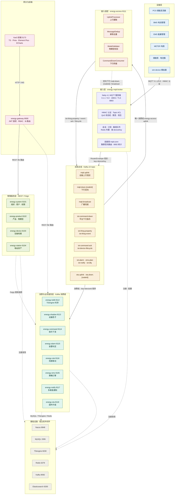
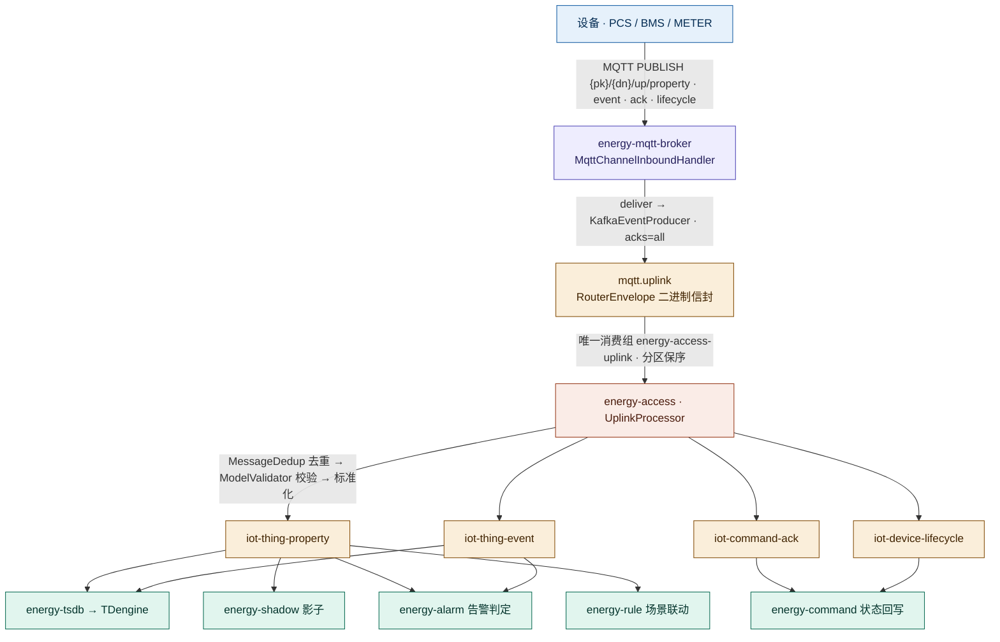
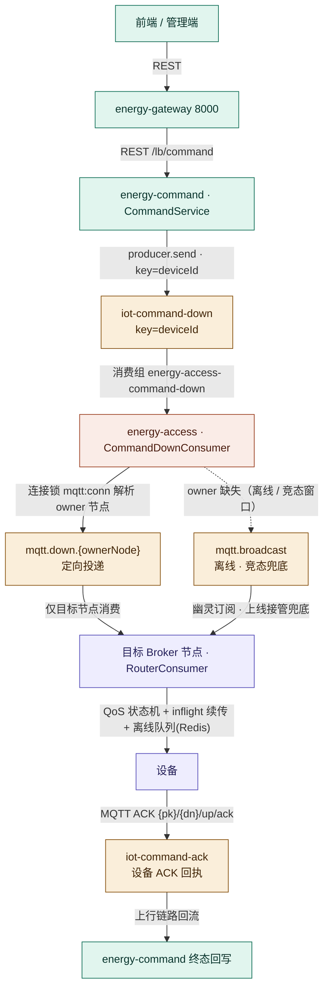

# EnergyX 储能管理平台（EMS）

面向新能源储能行业的企业级 IoT + EMS 平台。覆盖 集团→企业→电站→储能柜→电池簇→PCS→BMS→电芯 全链路资产管理，支持百万级设备接入、多租户、云边协同与 AI 能源优化。

自研 MQTT Broker 集群负责设备接入，**消息一出 Broker 全走 Kafka 事件总线**，后端服务（tsdb/shadow/alarm/command/ems/rule/notify/ota）全部以 Kafka 消费者身份协同，业务 CRUD 走 REST 网关 + Feign 跨库调用。

---

## 平台架构



| 层 | 职责 | 关键点 |
| --- | --- | --- |
| L1 设备层 | 储能全链路设备 | 真机或 `sim-device` 模拟器，HMAC 双向认证，`{pk}/{dn}/up/{type}` 主题约定 |
| L2 接入层 | 百万级长连接接入 | Netty 自研 Broker；QoS 0/1/2 状态机、限流背压、会话/订阅/离线队列全部外置 Redis；连接锁 `mqtt:conn:{deviceKey}` 支持多节点集群与定向路由 |
| L3 消息总线 | 全链路事件总线 | 22 topic 分三类：Broker 路由（mqtt.uplink / down / broadcast）、物模型事件（iot-thing-*）、业务事件（iot-alarm / ems-plan / ota.* / iot-notify / iot-dlq） |
| L4 接入适配 | Broker ↔ 业务的桥 | 唯一消费组摄取上行；幂等去重（Redis SETNX）、物模型校验、标准化转发；下行指令反向桥接为 MQTT |
| L5 消费与业务 | 平台核心能力 | 全部以 Kafka 消费者姿态消费物模型事件，互不阻塞；跨库数据经 Feign 按需回源 |
| L6 管理服务 | 基础档案 CRUD | system/product/device/station 四域独立库（MyBatis Plus 多模块重构），对外 REST |
| L7 网关前端 | 统一入口 | Gateway 统一鉴权（JWT 验签 + RBAC）+ `lb://` 路由 + WebSocket 实时推送 |
| L8 基础设施 | 宿主机中间件 | Nacos 注册配置、MySQL 业务库、TDengine 时序库（按产品分库 `st_prop_*`）、Redis、Kafka、ES 日志 |

---

## 数据流

**关键**：MQTT 只用于「设备 ↔ Broker」这一段；Broker 是「MQTT 接入 + Kafka 桥」一体，消息出了 Broker 全走 Kafka，后端服务全是 Kafka 消费者，**不订阅 MQTT 主题**。

### 设备上报（上行）



- **Broker 内部**：`MqttChannelInboundHandler` 完成 ACL / QoS 状态机 / 限流，`MessageDeliverer.deliver()` 先查本节点订阅（`deliverLocal`），再 `routeDirected()` 入 Kafka（幂等生产 `enable.idempotence + acks=all`）。
- **mqtt.uplink 唯一消费**：仅 energy-access 的 `energy-access-uplink` 组消费，无 fan-out，天然单写者归一。
- **OTA 命名空间**：`{pk}/{dn}/ota/{inform|progress|result|pull}` 由 access 透传到 `ota.uplink`，供 energy-ota 消费（固件升级独立于物模型链路）。

### 平台下发（下行）



### 多实例下的重复防护（三层）

1. **并发不重复**：同服务多实例共用同一 `groupId`，Kafka 消费组把分区互斥分配给组内成员——一个分区同一时刻只被一个实例消费（同组 = 分活干；不同组 = 广播，如 broker `mqtt-down-{nodeId}` 每节点一组是有意 fan-out）。
2. **Broker 不制造重复**：单条 MQTT 消息只入站一个 Broker 节点 + 生产侧幂等（`enable.idempotence` + `acks=all`）。
3. **重放不重复（at-least-once 兜底）**：崩溃/重连后的重发由各消费边界拦截——access/tsdb 用 `MessageDedup`（Redis SETNX，key=`iot:msg:dedup:{stage}:{device_id}:{message_id}`）；command/ems/alarm 用业务幂等（条件状态迁移、雪花唯一键、覆盖式 UPDATE）。

---

## 技术栈

| 层 | 技术 |
| --- | --- |
| 接入层 | 自研 Netty MQTT Broker（MQTT 3.1.1/5.0，HMAC 认证 + Topic ACL + QoS 状态机 + 限流/背压 + 离线队列），Redis 会话共享，Kafka 跨节点定向路由（连接锁 `mqtt:conn`） |
| 后端 | Java 17 / Spring Boot 3.x / Spring Cloud Alibaba（Nacos）/ Spring Security（JWT + RBAC）/ MyBatis Plus（BaseEntity + BaseMapper + 跨库 Feign） |
| 消息 | Kafka（22 topic 全链路事件总线：Broker 路由、物模型事件、业务事件、OTA、DLQ） |
| 存储 | MySQL 8（业务分域库）/ TDengine（时序 `st_prop_*` 按产品分库）/ Redis（会话 · 缓存 · 分布式锁）/ Elasticsearch（日志检索） |
| 服务治理 | Nacos / Spring Cloud Gateway / Sentinel（服务间经网关 `lb://` + Kafka 事件总线） |
| 前端 | Vue3 / TypeScript / Vite / Pinia / Element Plus / ECharts（含 WebSocket 实时推送） |
| 设备侧 | energy-mock-device 模拟器 / `sim-device` 联调工具 / MQTT SDK（`sdk/`） |

## 文档导航

- 整体架构设计：`docs/design/Phase1-整体架构设计.md`
- 数据库设计（MySQL/TDengine/ES/Redis/Kafka + DDL）：`docs/design/Phase2-数据库设计.md`
- 自研 MQTT Broker：`docs/design/Phase4-自研MQTTBroker.md`
- 消息处理模块：`docs/design/Phase5-消息处理模块.md`
- 业务模块（影子/指令/告警/策略引擎）：`docs/design/Phase6-业务模块.md`
- 场景联动与规则编排（Phase11）：`docs/design/Phase11-场景联动与规则编排设计.md`
- OTA 固件升级（Phase12）：`docs/design/Phase12-OTA升级设计.md`、`docs/design/Phase-OTA-子集灰度.md`
- 户用储能模块（Phase10）：`docs/design/Phase10-户用储能（Residential-Storage）模块设计.md`
- 生产化差距分析与路线图：`docs/design/Phase9-生产化差距分析.md`
- Redis Key 规范：`docs/design/Redis-key规范.md`、数据保留策略：`docs/design/数据保留策略.md`
- 模拟设备接入与验证：`docs/design/Phase-模拟设备.md`、`docs/sim-device-使用验证指南.md`
- 技术决策记录（ADR）：`docs/decisions/ADR-技术决策记录.md`
- 管理后台页面设计：`docs/superpowers/specs/2026-08-08-admin-pages-design.md`
- DDL：`sql/mysql/`（分域 00~80 + `sharding/`）、`sql/tdengine/`、`sql/elasticsearch/`

## 快速启动（全栈）

```bash
# 1) 构建后端（含 SDK/压测工具；仅首次或改码后）
cd backend && mvn -Dmaven.repo.local="/d/Program Files/maven-repo" package -DskipTests

# 2) 启动全栈（Git Bash）：Docker 基础环境 + MySQL 校验 + 各后端服务 + 就绪轮询
deploy/scripts/start-stack.sh          # 首次构建缺失 jar 后再启动
deploy/scripts/status-stack.sh         # 查看服务/端口/基础环境/Broker 统计
deploy/scripts/stop-stack.sh           # 停止后端（--infra 连带停 Docker）

# 3) 故障演练（需全栈在跑）
cd test/drill && ./run-all.sh
```

> 前置：Docker Desktop（Nacos/Kafka/Redis/ES/TDengine）、本机 MySQL 服务（127.0.0.1:3306，见 `deploy/env/local.env`）、Java 17。

### 端口分配

**应用服务**（8000~8118 业务微服务 + Broker 统计 + 前端）

| 端口 | 服务 | 端口 | 服务 |
| --- | --- | --- | --- |
| 8000 | energy-gateway | 8111 | energy-access |
| 8101 | energy-system | 8112 | energy-tsdb |
| 8102 | energy-product | 8113 | energy-shadow |
| 8103 | energy-device | 8114 | energy-command |
| 8104 | energy-station | 8115 | energy-alarm |
| 8105 | energy-ems | 8116 | energy-rule |
| 8117 | energy-notify | 8118 | energy-ota |
| 8082 | MQTT Broker 统计 HTTP（Prometheus） | 5173 | 前端 Dev |

**中间件**

| 端口 | 组件 | 端口 | 组件 |
| --- | --- | --- | --- |
| 18831 | MQTT 设备接入（`BROKER_MQTT_PORT`，Windows Hyper-V 动态端口段可调） | 8883 | MQTT TLS |
| 8848/9848 | Nacos | 9092 | Kafka |
| 6379 | Redis | 9200 | Elasticsearch |
| 6030 | TDengine | 3306 | MySQL |

## 目录结构

```text
EnergyStorageIotPlatform/
├── backend/       # 后端微服务（15 模块：14 服务 + energy-common/security-core 公共库 + mock-device）
├── frontend/      # 前端 Vue3（api/ components/ views/ stores/ ws/ ...）
├── docs/          # 设计文档（design/ + decisions/ + superpowers/）
├── sql/           # 数据库 DDL（mysql/tdengine/elasticsearch）
├── sdk/           # 设备端 MQTT SDK
├── deploy/        # 部署与本地环境（docker-compose + 启动/停止/状态脚本）
└── test/          # 压测与故障演练（drill/）
```
