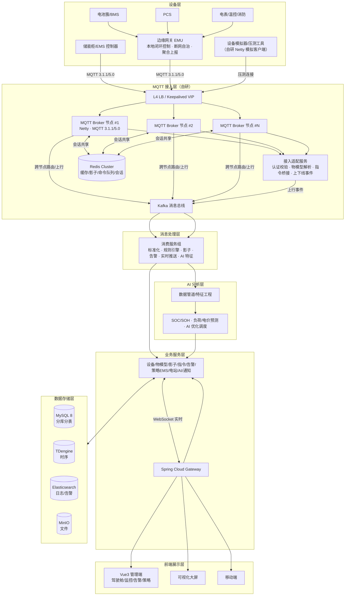
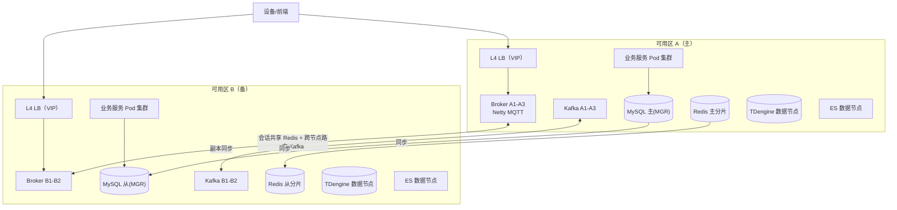
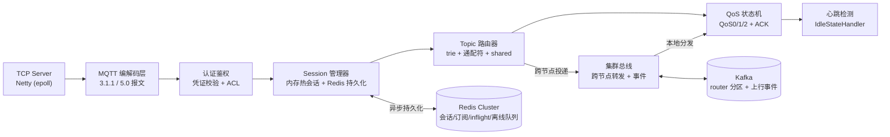
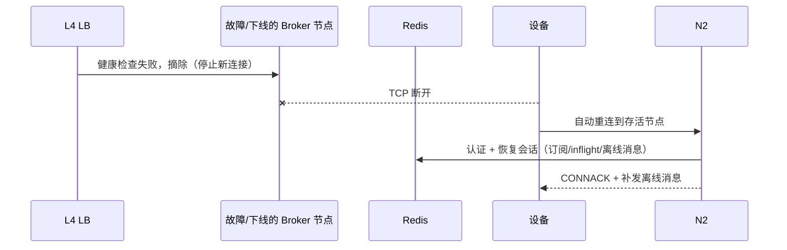
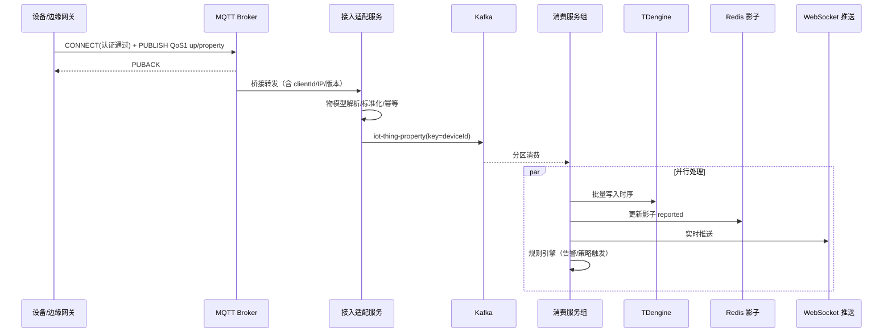
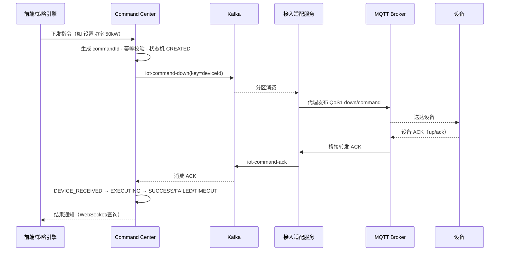

# 深圳三多能源储能管理平台 — Phase 1 整体架构设计

> 阶段目标：完成系统整体架构设计，明确分层、服务拆分、数据流、消息流、高可用与扩容方案。
> 本阶段不写代码，产出架构设计文档，作为后续 Phase 2~8 的总体依据。

| 项目 | 内容 |
| --- | --- |
| 项目名称 | 深圳三多能源储能管理平台（虚拟项目） |
| 阶段 | Phase 1：整体架构设计 |
| 版本 | v2.0（修订：接入层改为自研 Netty MQTT Broker，时序库改为 TDengine） |
| 日期 | 2026-08-06 |
| 设计定位 | 面向新能源储能行业的企业级 IoT + EMS 平台 |

---

## 1. 设计目标与关键指标

### 1.1 业务目标

- 覆盖 集团 → 企业 → 电站 → 储能柜 → 电池簇 → PCS/BMS → 电芯 的全链路资产管理；
- 支撑百万级设备接入与在线管理；
- 提供物模型、设备影子、指令下发、告警、策略引擎、AI 优化等企业级 IoT + EMS 能力；
- 支持云边协同：边缘侧毫秒级安全闭环，云端分钟级优化调度；
- 多租户隔离，支持多家运营商/企业共用平台。

### 1.2 关键非功能指标（容量模型）

| 指标 | 目标值 | 说明 |
| --- | --- | --- |
| 接入规模 | 100 万设备在线 | 自研 Netty MQTT Broker 集群（3~5 节点） |
| 上行消息 | 平均 20 万 msg/s，峰值 50 万 msg/s | 每设备 5s 聚合上报 1 条，事件突发按 2.5 倍 |
| 时序点数 | 峰值 500 万 points/s | 每条消息含 10~30 个属性点 |
| 下行指令 | 峰值 1 万 cmd/s | 策略批量下发、人工控制 |
| 控制链路延迟 | 云链路 P99 ≤ 500ms；边缘闭环 ≤ 100ms | 不含公网 RTT 波动 |
| 告警检测延迟 | 数据到达后 ≤ 3s | 规则引擎 + 告警中心 |
| 可用性 | 99.95%（年停机 ≤ 4.4h） | RTO ≤ 5min，RPO ≤ 1min |
| 数据保留 | 明细 1 年，聚合 5 年，日志 180 天 | 降采样/归档策略 |

---

## 2. 架构设计原则

1. **接入与业务解耦**：MQTT Broker 只负责连接与消息路由，接入适配层负责认证、物模型解析，业务服务不感知协议细节；Broker 与接入层之间以标准事件（Kafka）交互，Broker 具备被替换的抽象边界；
2. **事件驱动 + 削峰填谷**：Kafka 作为全链路消息主干，设备数据、指令、生命周期均以事件形式流转；
3. **状态即服务**：设备影子（reported/desired）作为设备状态的统一视图，时序数据只存历史、不承担状态查询；
4. **控制分级闭环**：边缘安全保护（BMS/PCS 保护、过温过压）必须在边缘完成，不依赖云端；云端只做优化级控制，且下发值必须经过安全包络校验；
5. **多租户隔离**：数据层行级/库级隔离，资源配额 + 限流 + 审计；
6. **可观测性内建**：全链路 TraceId（MQTT 报文 → Kafka → 业务）、指标、日志、Kafka lag 一体观测。

---

## 3. 系统总体架构

### 3.1 分层架构图



### 3.2 各层职责

| 层 | 组件 | 职责 |
| --- | --- | --- |
| 设备层 | 储能柜/EMS 控制器、电池簇/BMS、PCS、电表/温控/消防、边缘网关 EMU、设备模拟器 | 数据采集、本地闭环控制、断网自治、MQTT 直连或经网关汇聚上报 |
| MQTT 接入层 | 自研 Netty MQTT Broker 集群、L4 LB、接入适配服务 | 百万级 TCP 长连接、MQTT 3.1.1/5.0 编解码、设备认证、Session 管理、QoS/ACK、心跳保活、跨节点路由、消息转换 |
| 消息处理层 | Kafka、消费服务组 | 消息标准化、过滤、规则引擎、影子同步、告警检测、实时推送、AI 特征提取 |
| 业务服务层 | Gateway + 微服务集群 | 设备/物模型/影子/指令/告警/策略 EMS/电站/AI/通知/报表/审计 |
| 数据存储层 | MySQL 8、TDengine、Redis Cluster、Elasticsearch、MinIO | 业务数据、时序数据、缓存/队列/影子/会话、日志检索、文件 |
| AI 分析层 | 数据管道、模型服务 | SOC/SOH 估算、负荷/电价预测、充放电优化调度、健康评估 |
| 前端展示层 | Vue3 管理端、大屏、移动端 | 能源驾驶舱、电站监控、实时功率曲线、SOC/SOH 趋势、告警中心、策略配置、设备管理 |

### 3.3 部署拓扑（高可用形态）



---

## 4. 自研 MQTT Broker 核心架构设计（架构级）

> 详细协议实现、报文级状态机、Netty Channel 生命周期将在 Phase 4 展开。
> 本节定义架构层面的三件大事：**集群会话共享**、**跨节点 Topic 路由**、**连接容量与故障接管**。

### 4.1 职责边界

Broker 只做"连接 + 消息路由"，不碰业务：

- **承担**：TCP 长连接、MQTT 3.1.1/5.0 报文编解码、Session（订阅/保留/遗嘱）、QoS 状态机、心跳保活、跨节点消息路由、设备认证鉴权；
- **不承担**：物模型解析、影子、规则、指令业务语义——这些全部下沉到接入适配服务与消费服务组，Broker 通过 Kafka 以标准事件暴露。

> 这样设计的目的：Broker 的每一行代码都只跟协议相关，可以单独压测、单独替换（如未来换 EMQX），业务服务不感知。

### 4.2 Broker 节点内部模块



### 4.3 连接容量与线程模型

**百万连接的量级分析（关键）**：

| 项 | 估算 | 说明 |
| --- | --- | --- |
| 单连接内存 | 10~50 KB | ChannelContext + 解码缓冲 + Session 元数据 + inflight 窗口 |
| 单节点容量 | 30 万~50 万连接 | 32GB 堆 + off-heap 直缓冲；epoll 下 idle 连接 CPU 开销极低 |
| 集群规模 | 3~5 个节点 | 满足 100 万在线 + 单节点故障冗余 |
| 每秒新建连接 | 峰值 1 万 conn/s | 上线风暴（计划性策略下发/开机潮）需限流排队 |

**线程模型**：

- `bossGroup`（1~2 线程）：accept 新连接；
- `workerGroup`（CPU 核数 × 2）：IO 读写 + MQTT 编解码，Handler 全部无阻塞；
- 独立**业务线程池**：认证调用、Redis 会话持久化、跨节点投递等可能阻塞的操作全部从 IO 线程剥离（否则一个慢调用拖垮整条 worker 线程的连接）；
- 消息编解码使用 off-heap 直缓冲 + 引用计数，减少拷贝。

**系统层调优**：文件描述符 `ulimit -n` 调至百万级；`SO_BACKLOG`/`TCP_NODELAY`/`SO_KEEPALIVE`/`TCP_FASTOPEN`；堆外内存与 `MaxDirectMemorySize` 估算预留。

### 4.4 集群会话共享（Session Sharing）

设备可以随时连接集群中任意节点，会话必须可迁移。设计为**内存热会话 + Redis 持久化**：

| Redis Key | 结构 | 内容 |
| --- | --- | --- |
| `mqtt:session:{deviceKey}` | Hash | 会话元数据：所在节点、cleanSession、遗嘱消息、连接时间戳 |
| `mqtt:subs:{deviceKey}` | Set | 订阅列表 `topic@qos` |
| `mqtt:inflight:{deviceKey}` | ZSet/List | QoS1/2 待确认消息（幂等 key 去重） |
| `mqtt:offline:{deviceKey}` | List | 离线消息队列（容量上限 + TTL） |
| `mqtt:conn:{deviceKey}` | String | 连接归属锁（同 clientId 单连接，踢线用） |

- **热路径不查 Redis**：设备在线时，Session/订阅在节点内存中；Redis 写入为异步批量 + 变更兜底，避免每个报文打 Redis；
- **故障接管**：节点宕机 → 设备 TCP 断开 → 客户端自动重连任意存活节点 → 认证通过后从 Redis 恢复会话（CleanSession=false 时恢复订阅/inflight/离线消息）；
- **双连接防护**：同一 clientId 新连接到达时，通过 `mqtt:conn` 锁 + 节点间踢线事件，将旧连接在归属节点踢掉（新连接优先），防止控制指令投递到过期连接。

### 4.5 跨节点 Topic 路由

设备 A 在节点 X 发布，订阅者 B 在节点 Y，必须跨节点投递：

- **节点内路由**：本地 Topic trie + 通配符（`+`/`#`）+ Shared Subscription（`$share/{group}/`）直接分发；
- **跨节点路由**：发布方节点按 `hash(topic)` 投递到 Kafka 专用 topic `mqtt.router` 的对应分区；订阅方节点消费该分区，取回与本地订阅匹配的消息做本地分发；
- **优化**：L4 层按 clientId 一致性哈希尽量将同一设备固定在同一节点，热点设备的跨节点转发被大幅压缩；
- **去重**：跨节点消息带 `sourceNode + packetId`，投递幂等去重。

### 4.6 心跳保活与离线判定

- 基于 Netty `IdleStateHandler`：读空闲超时 = `1.5 × keepAlive`（协议建议 1.5 倍），触发主动断开并清理会话；
- 设备设置遗嘱（Will）时，断开触发遗嘱发布；
- 平台侧离线判定：**遗嘱 + 会话过期**双通道，默认 30s 内判定离线（可配置），避免短暂网络抖动造成误判；
- 心跳报文（PINGREQ/PINGRESP）走 worker 线程直回，不做业务逻辑。

### 4.7 QoS 状态机

| QoS | 行为 | 存储 | 失败处理 |
| --- | --- | --- | --- |
| QoS0 | 尽力投递，不确认 | 无 | 丢弃 |
| QoS1 | PUBLISH → PUBACK，至少一次 | inflight 去重 key | 重试，超时后重发 |
| QoS2 | PUBLISH → PUBREC → PUBREL → PUBCOMP，恰好一次 | 两次握手各记一个幂等状态 | 断线重连后按状态机续走 |

- QoS2 的两次握手状态持久化到 Redis，连接迁移后可从 `PUBREC 已收` 状态继续，不会重复执行；
- 储能控制类指令使用 QoS1 + 业务幂等（commandId），见 Phase 6 Command Center。

### 4.8 设备认证：防伪 / 防重放 / 防伪造

**CONNECT 凭证规范**：

- `clientId = {productKey}_{deviceName}`（消息路由与 ACL 的身份锚点）；
- MQTT5 场景优先走 Property（Authentication Method/Data）；
- 认证流程：Broker 拦截 CONNECT → 调接入适配服务认证接口（本地 + Redis 缓存凭据）→ 通过后放行并建立会话。

**防伪（非法设备接入）**：

- 设备出厂预置 `productKey/deviceName/deviceSecret`，注册时服务端为其签发设备凭证并落库；
- 连接时计算 `sig = HMAC-SHA256(deviceSecret, clientId + timestamp + nonce)` 作为 password；
- 服务端用库中 deviceSecret 重算比对，失败直接拒连；连续失败 N 次触发设备封禁 + 限速（连接风暴防护）。

**防重放（截获重放 CONNECT）**：

- 一次性 `nonce`：Redis `SETNX mqtt:nonce:{nonce}`，TTL 5min，用过即失效；
- `timestamp` 窗口校验（±2min），过期拒绝；
- 可选 TLS 双向认证（设备证书），从传输层杜绝中间人重放。

**防伪造（伪冒 topic）**：

- Broker ACL 强制约束：设备只能 publish 到 `{productKey}/{deviceName}/up/...`、只能 subscribe 到 `{productKey}/{deviceName}/down/...`，且 `productKey` 必须与 CONNECT 身份一致；
- 下行 topic 只允许平台侧（Broker 内部代理发布），设备侧 publish 一律拒绝。

### 4.9 优雅停机与故障转移



- **被动故障**：健康检查摘除 → 设备重连 → Redis 会话接管（见 4.4）；
- **主动停机**：先摘除 L4 → MQTT5 `DISCONNECT`（reason code `0x8B` Server shutting down）通知设备重连 → 停止接收新消息 → 将 in-flight 与会话状态落 Redis → 超时强制退出。

---

## 5. 服务拆分

| 服务 | 职责 | 关键存储/中间件 | 扩展性 |
| --- | --- | --- | --- |
| energy-gateway | 统一入口：路由、鉴权、限流、WebSocket 聚合 | Redis（限流/会话） | 无状态，多副本 |
| energy-system | 租户、用户、权限 RBAC、集团-企业-电站组织树 | MySQL | 无状态 |
| energy-product | 产品管理、物模型定义（属性/服务/事件 + JSON Schema） | MySQL、Redis 缓存 | 无状态 |
| energy-device | 设备生命周期（注册/激活/认证/在线/离线/删除）、凭据与证书、设备拓扑 | MySQL、Redis | 分库分表（enterprise_id/device_id） |
| **energy-mqtt-broker** | **自研 Netty MQTT Broker：连接/Session/QoS/心跳/跨节点路由** | Redis（会话）、Kafka（router/上行） | 按连接数水平扩展节点 |
| energy-access | MQTT 接入适配：认证钩子、物模型解析、上行入 Kafka、下行发布、QoS/ACK 桥接 | Kafka、Redis | 按分区并行消费 |
| energy-message | 消息标准化、过滤、幂等去重、路由分发 | Kafka、Redis | 按分区并行消费 |
| energy-shadow | 设备影子：reported/desired/delta、版本冲突处理 | Redis、MySQL（持久化） | 影子按设备分片 |
| energy-command | Command Center：指令状态机、队列、超时重试、ACK、幂等 | Redis、Kafka、MySQL | 按设备分区 |
| energy-tsdb | 时序写入、查询聚合、降采样 | TDengine | 多副本 + 数据节点扩展 |
| energy-alarm | 告警规则、检测、合并、恢复、升级、通知触发 | Kafka、MySQL、ES | 规则引擎独立扩展 |
| energy-ems | 策略引擎：峰谷套利、需量管理、需求响应、SOC 约束，输出充放电计划 | MySQL、Redis、Kafka | 与 AI 服务解耦 |
| energy-station | 电站资产、储能柜/簇拓扑、实时状态聚合 | MySQL、Redis、TDengine | 只读缓存聚合 |
| energy-ai | SOC/SOH 估算、负荷/电价预测、AI 优化调度 | 特征库、模型服务 | 独立资源池 |
| energy-notify | 短信/邮件/企业微信/App 推送 | Kafka、Redis | 无状态 |
| energy-log | 设备日志、操作日志、审计 → ES | Kafka、ES | ILM 分层 |
| energy-report | 能源报表、结算 | MySQL、TDengine | 异步任务 |

支撑组件：Nacos（注册/配置）、Sentinel（限流熔断）、xxl-job（定时）、SkyWalking（链路）、Prometheus/Grafana（指标）。

边缘侧（不属于微服务，但属于架构一部分）：edge-emu 边缘网关，负责高频采集、本地策略、断网自治、批量补报；cloud→edge 只下发策略参数与指令。

---

## 6. 关键数据流

### 6.1 设备上行（上报）

Topic 约定：`{productKey}/{deviceName}/up/{type}`，type ∈ property | event | lifecycle | ack。



链路：设备 CONNECT 认证 → PUBLISH（QoS1，Broker 回 PUBACK）→ Broker 桥接 → 接入适配服务（报文校验、物模型解析、标准化）→ Kafka → 消费服务组并行处理（TSDB 写入、影子更新、规则引擎、WebSocket 推送、AI 特征）。

### 6.2 平台下行（指令）

Topic：`{productKey}/{deviceName}/down/command`。



链路：前端/策略引擎 → Command Center（生成 commandId、幂等校验、状态机 CREATED）→ Kafka `iot-command-down` → 接入适配服务 → Broker 代理发布（QoS1）→ 设备 → 设备 ACK → 接入适配服务 → Kafka `iot-command-ack` → Command Center 状态机流转。

设备离线：指令落 Redis（按设备队列）+ MySQL 记录，设备上线后影子同步 desired 并补发指令（详见 Phase 6/7）。

### 6.3 设备生命周期

CONNECT → Broker 认证钩子（校验 productKey/deviceName/deviceSecret/证书 + 设备状态）→ 通过后建立会话 → 上线事件（含 clientId、IP、版本）入 Kafka `iot-device-lifecycle` → 设备服务更新在线状态、影子触发 delta、消息服务恢复离线指令。

离线检测：LWT 遗嘱 + 会话过期时间；默认 30s 内判定离线（可配置）。

---

## 7. 消息处理架构（Kafka）

### 7.1 Topic 设计

| Topic | 内容 | Key | 分区数 | 保留期 | 消费组 |
| --- | --- | --- | --- | --- | --- |
| iot-raw | 原始报文（追踪/补数） | messageId | 24 | 24h | trace |
| iot-thing-property | 标准化属性上报 | deviceId | 48 | 7d | tsdb-writer, shadow-updater, rule-engine, ws-pusher, ai-feature |
| iot-thing-event | 设备事件（告警/故障） | deviceId | 24 | 30d | alarm, rule-engine |
| iot-device-lifecycle | 上线/离线 | deviceId | 24 | 7d | device, shadow |
| iot-command-down | 下行指令 | deviceId | 24 | 7d | access-adapter |
| iot-command-ack | 指令 ACK | commandId | 24 | 30d | command |
| iot-alarm | 告警事件 | deviceId | 12 | 30d | notify, ws-pusher |
| iot-shadow-delta | 影子差异 | deviceId | 24 | 7d | access-adapter, ws-pusher |
| ems-plan | 策略输出计划 | stationId | 12 | 30d | command, report |
| iot-audit | 操作审计 | operatorId | 12 | 180d | log |
| **mqtt.router** | **Broker 跨节点消息路由** | topic | 24 | 1h | broker 节点 |

### 7.2 顺序保证

- 同一设备的所有属性/事件消息以 `deviceId` 为 key，保证写入同一分区，天然有序；
- 消费端单分区单线程（或顺序提交），保证同一设备处理顺序；
- 下行指令同样按 `deviceId` 分区，保证同一设备的指令串行下发，避免乱序控制；
- Broker 跨节点路由按 `topic` 分区，同一主题的转发保序；
- 跨设备、跨租户不要求全局顺序。

### 7.3 重复与丢失处理

- **重复**：生产者开启幂等（`enable.idempotence=true`），客户端生成 messageId，消费端 Redis SETNX 去重（TTL 5min）；下游写入全部幂等（影子 version 乐观锁、TDengine 按 dedup key、指令状态机守卫）；
- **丢失**：生产者 `acks=all` + `min.insync.replicas=2` + 重试；消费者手动提交（`enable.auto.commit=false`），先处理再提交；处理失败进重试 topic（指数退避），超过阈值进 DLQ；
- **重放**：Kafka 保留期内可按分区回放重建影子/时序；
- **背压**：Broker 批量桥接 + 缓冲；消费端按 lag 动态扩容；Sentinel 限流保护下游。

---

## 8. 高可用设计

| 层 | 方案 |
| --- | --- |
| MQTT 接入 | 自研 Broker 3~5 节点集群（跨双可用区），L4 LB 前置；Session 经 Redis 共享，节点故障设备重连任意节点即接管（见 4.4）；同 clientId 单连接踢线防护；认证钩子缓存凭据 + 连接风暴限速；离线判定 30s 内恢复 |
| 消息总线 | Kafka 3+ 节点，`replication.factor=3`，`min.insync.replicas=2`，机架感知；Controller 高可用；lag 监控 + 告警；DLQ 兜底 |
| 业务库 | MySQL 8 MGR 单主多从（跨可用区），ShardingSphere 读写分离；binlog PITR 备份；按租户分库、按设备分表 |
| 时序库 | TDengine 多副本（raft 组），数据节点水平扩展；降采样 + 保留策略控制成本 |
| 缓存 | Redis Cluster 3 主 3 从起步，跨可用区；AOF everysec + RDB；热 key 本地缓存 + key 打散；命令/影子持久化在 MySQL，Redis 仅做加速 |
| 日志检索 | ES 3 master + 3 data（冷热分层），ILM 生命周期管理 |
| 业务服务 | 无状态 + K8s 多副本 + HPA；Nacos 注册/配置；Sentinel 限流熔断降级；Feign 超时重试（仅幂等接口）；优雅停机；健康检查 |
| 整体灾备 | 同城双活（双可用区，读流量双活，写在主 AZ）；异地灾备 RPO ≤ 1min（binlog 同步 + Kafka MirrorMaker2），RTO ≤ 30min |

---

## 9. 扩容方案

| 层 | 扩容方式 | 触发条件 |
| --- | --- | --- |
| MQTT 接入 | 增加 Broker 节点（预估单节点 30 万连接），Nacos 注册 + L4 权重调整；新连接自动分发，存量连接经 Redis 会话接管 | 在线连接数 > 70% 容量 |
| 消息总线 | 增加 Kafka broker，topic 已预建 24/48 分区，迁移分区 | 分区吞吐/磁盘水位 |
| 业务服务 | K8s HPA（CPU/RT/QPS） | QPS/RT 指标 |
| MySQL | 先加只读从库，再按 enterprise_id 分库、device_id 分表；冷数据归档 | 连接数/慢查询/容量 |
| TDengine | 增加数据节点（vnode 自动再平衡）；提升降采样粒度 | 写入吞吐/查询延迟 |
| Redis | Cluster 增加分片；热点 key 本地缓存/打散 | CPU/内存水位 |
| ES | 增加数据节点，ILM 冷热分层 | 容量/查询延迟 |

多租户扩展：小租户共享库（tenant_id 行级隔离）；大租户独立分库/独立 TSDB 实例（资源隔离）；Nacos 命名空间 + 配额管理。

---

## 10. 关键技术决策

| 决策点 | 方案对比 | 结论与理由 |
| --- | --- | --- |
| MQTT Broker | 自研 Netty Broker vs EMQX | 选**自研 Netty Broker**：协议栈完全掌控，百万连接/session 共享/跨节点路由/QoS 状态机全链路自研，作为本平台最核心的技术亮点与差异化能力；代价是工程量大，通过"内存热会话 + Redis 持久化 + Kafka 跨节点路由"的架构控制复杂度；Broker 与接入层以标准事件解耦，保留替换路径 |
| 时序库 | TDengine vs InfluxDB vs TimescaleDB | 选 **TDengine**：标签+时间线模型天然契合"按设备/按指标"查询，SQL 兼容、写入吞吐极高、资源占用低、自带降采样与保留策略，是国内储能行业事实标准；InfluxDB 高基数性能与商业授权是短板；TimescaleDB 超大规模写入聚合性能不足 |
| 消息总线 | Kafka vs RocketMQ vs Pulsar | 选 Kafka：高吞吐、分区有序、可重放、生态完善；可靠性用 at-least-once + 幂等兜底 |
| 业务库 | MySQL 8 + MyBatis Plus + ShardingSphere | 事务与生态成熟，MP 提效，ShardingSphere 分库分表 + 读写分离；规模超限时具备迁移 TiDB 的路径 |
| 缓存 | Redis Cluster | 在线状态、影子、命令队列、Broker 会话共享、分布式锁（Redisson）、限流 |
| 日志检索 | Elasticsearch + ILM | 设备/操作/告警日志全文检索与聚合，冷热分层控制成本 |
| 注册配置 | Nacos | 与 Spring Cloud Alibaba 生态一致，命名空间天然支持多环境/多租户 |
| 实时推送 | WebSocket + Kafka 扇出 | 驾驶舱/监控实时刷新；Gateway 统一鉴权与连接管理；避免业务服务直连前端 |
| 云边协同 | 边缘 EMU + 云端策略引擎 | BMS/PCS 安全保护必须边缘闭环（毫秒级）；云端做分钟级优化并下发策略参数；断网时边缘自治 |
| AI 优化 | 独立 AI 服务 + 特征管道 | 不阻塞主数据链路；AI 输出必须经策略引擎安全包络校验后才可下发 |
| 可观测性 | SkyWalking + Prometheus/Grafana + Kafka lag | 全链路 TraceId（MQTT→Kafka→业务），指标与告警一体 |
| 工程结构 | Maven 多模块 monorepo | 统一 Java17/Spring Boot 3.x 版本，服务可独立部署与水平扩展 |

---

## 11. 项目目录结构（规划）

```text
Energy Storage IoT Platform/
├── docs/
│   ├── design/            # 架构与设计文档（本文件）
│   └── decisions/         # ADR 技术决策记录
├── deploy/
│   ├── docker/            # 本地环境 docker-compose（MySQL/Redis/Kafka/ES/TDengine/Nacos）
│   ├── k8s/               # K8s manifests / Helm
│   └── scripts/           # 初始化与发布脚本
├── backend/
│   ├── pom.xml            # 父 POM（Java17 / Spring Boot 3.x / Spring Cloud Alibaba）
│   ├── energy-common/     # 通用：统一返回/异常/工具/常量/幂等/锁
│   ├── energy-gateway/    # Spring Cloud Gateway
│   ├── energy-system/     # 租户/用户/权限/组织
│   ├── energy-product/    # 产品与物模型
│   ├── energy-device/     # 设备生命周期/拓扑/认证凭据
│   ├── energy-mqtt-broker/# 自研 MQTT Broker（Netty）
│   ├── energy-access/     # MQTT 接入适配/认证钩子/指令桥接
│   ├── energy-message/    # 消息标准化/消费路由
│   ├── energy-shadow/     # 设备影子
│   ├── energy-command/    # Command Center
│   ├── energy-tsdb/       # 时序存储服务
│   ├── energy-alarm/      # 告警中心
│   ├── energy-ems/        # 储能策略引擎
│   ├── energy-station/    # 电站资产与实时聚合
│   ├── energy-ai/         # AI 优化服务
│   ├── energy-notify/     # 通知中心
│   ├── energy-log/        # 日志/审计 → ES
│   └── energy-report/     # 报表服务
├── edge/                  # 边缘网关程序（Java）
├── sdk/                   # 设备端 MQTT SDK（Java/C）
├── frontend/
│   ├── admin/             # 管理端 Vue3 + TS + Vite + Pinia + Element Plus
│   └── dashboard/         # 可视化大屏
└── test/
    ├── benchmark/         # 自研模拟器压测（连接/消息/指令）
    └── chaos/             # 故障演练脚本
```

---

## 12. Phase 1 测试方案（架构验证）

1. **连接压测**：自研模拟器从 10 万逐步到 100 万连接，观察 Broker 节点资源（CPU/内存/FD/连接数）、L4 LB 与认证接口吞吐、会话接管延迟；
2. **消息链路压测**：模拟 20 万~50 万 msg/s 注入，验证 Broker 吞吐、Kafka 分区消费、TDengine 写入、影子更新、告警检测延迟 P99；
3. **指令链路压测**：1 万 cmd/s，验证 Command Center 状态机、超时重试、幂等，控制链路 RTT P99 ≤ 500ms；
4. **故障演练（Chaos）**：随机杀 Broker 节点/Kafka broker/MySQL 主库，验证会话接管、消费恢复、读写切换；断网验证边缘自治；
5. **容量验证**：对照第 1 节指标输出压测报告，反推节点规模与调优参数；
6. **代码质量门禁**：Checkstyle/SpotBugs、单元/集成测试覆盖率、安全扫描（依赖与凭据）。

---

## 13. 下一阶段任务（Phase 2：数据库设计）

1. MySQL：组织/租户/用户、产品、设备、凭据证书、设备拓扑、物模型 Schema、策略、告警规则、指令记录、操作审计等表设计（ER 图 + DDL）；
2. TDengine：STABLE 设计（属性/事件），标签体系（deviceId/productKey），保留策略与降采样；
3. Elasticsearch：设备日志/操作日志/告警索引设计与 ILM；
4. Redis：key 规范（设备状态、影子、命令队列、Broker 会话、限流、分布式锁）；
5. Kafka：正式 Topic 清单与分区规划落地（含 mqtt.router）；
6. 输出《Phase 2 数据库设计文档》+ DDL 脚本，并组织设计评审。
