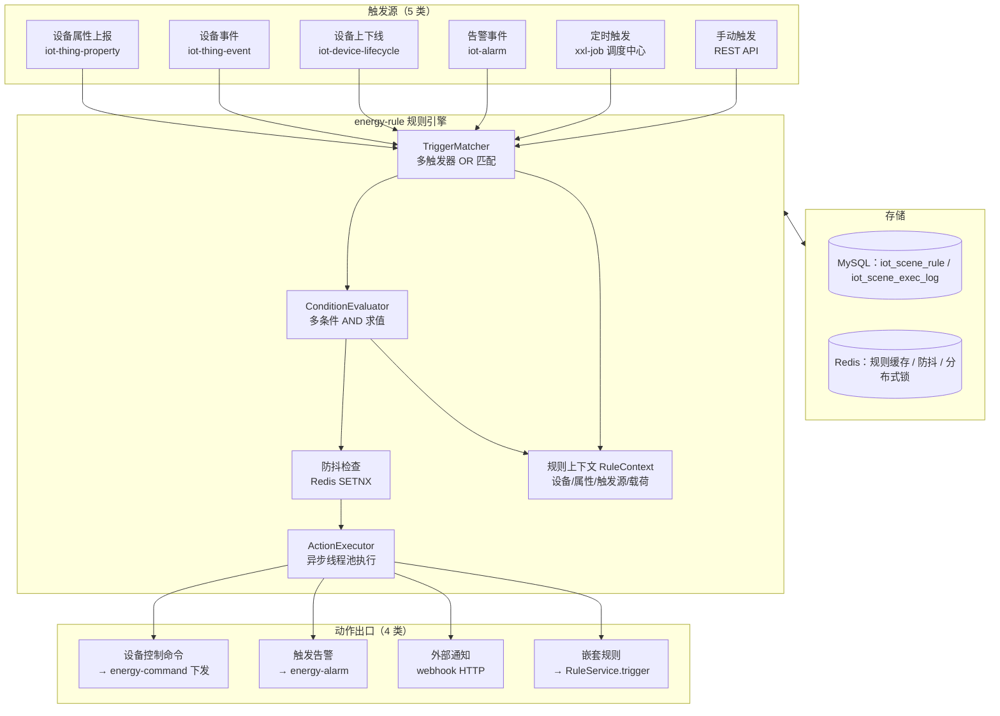
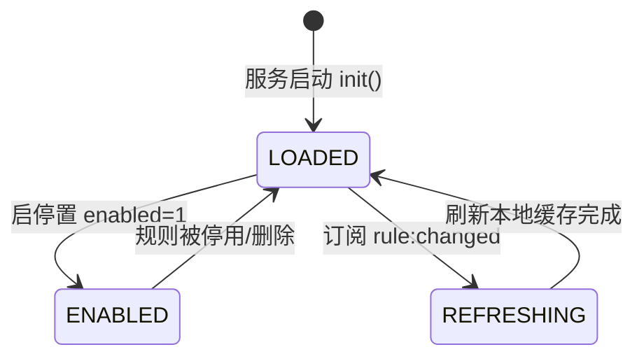
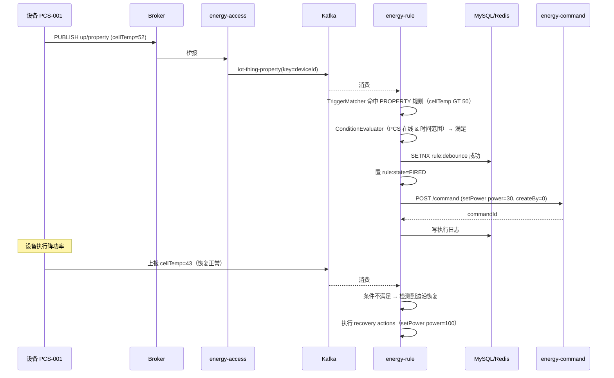
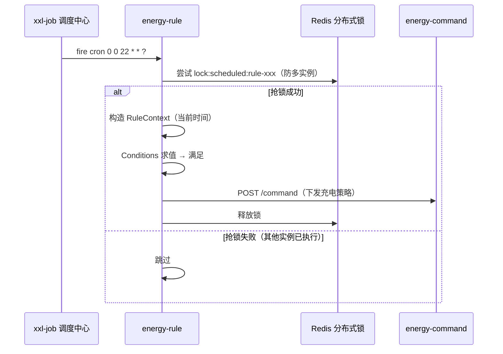

# EnergyX 储能管理平台 — Phase 11 场景联动与规则编排设计

> 阶段目标：设计并落地「场景联动 / 规则编排」功能（Rule Engine），采用 TCA（Trigger-Condition-Action）模型，
> 支持设备属性触发、定时触发、设备上下线触发、告警触发、手动触发五类触发源，
> 支持设备控制命令、触发告警、外部通知、嵌套规则四类动作。
> 本阶段先产出详细设计文档（数据模型 / 接口 / 时序 / 引擎设计），评审通过后进入编码。

| 项目 | 内容 |
| --- | --- |
| 项目名称 | EnergyX 储能管理平台 |
| 阶段 | Phase 11：场景联动与规则编排 |
| 版本 | v0.1（设计稿） |
| 日期 | 2026-08-14 |
| 设计定位 | 在既有 Kafka 消息总线之上构建可视化规则编排能力，与告警中心、命令中心解耦协作 |

---

## 1. 背景与目标

### 1.1 业务背景

平台已具备设备接入、物模型、影子、命令下发、告警中心、时序存储等能力。运营侧存在大量
「设备间联动、设备与时间联动」的自动化需求，例如：

- 电芯温度持续 > 50℃ → 下发 PCS 降功率命令；
- 每天 22:00（谷段电价开始）→ 下发充电策略；
- PCS 离线 → 触发告警并通知值班人员；
- 消防告警触发 → 联动下发全站下电命令（嵌套规则串联）；
- 调度人员在运营大屏一键执行「安全巡检」场景（手动触发）。

此类逻辑如果散落在各业务代码中，将导致「改一次需求发一次版」。需要一个**可视化、可编排、
可启停、可审计**的规则引擎，让运营人员自助配置。

### 1.2 目标

1. 提供 TCA 模型规则编排：触发器（Trigger，多触发器 OR）→ 执行条件（Condition，多条件 AND）→ 执行动作（Action，多动作独立执行）；
2. 五类触发源：设备属性上报、定时（cron）、设备上下线、告警事件、手动触发；
3. 四类动作：设备控制命令、触发告警、外部通知（webhook）、嵌套规则；
4. 动作防抖（避免高频上报轰炸）、执行审计日志、规则热更新（不重启生效）；
5. 与现有告警中心、命令中心解耦协作，不重复造轮子。

### 1.3 非目标（本期不做）

- 不做 ThingsBoard 式节点图编排（Phase 12 视需要评估，TCA 模型预留 script 扩展点）；
- 不做复杂流式计算（窗口聚合、CEP 复杂事件处理）；
- 不做边缘侧规则（edge-emu 本地策略另立）。

---

## 2. 业界方案调研结论

| 平台 | 规则模型 | 触发源 | 动作 | 对我们的启发 |
| --- | --- | --- | --- | --- |
| 阿里云 IoT 场景联动 | **TCA**：触发器 / 执行条件 / 执行动作 | 设备触发（属性/事件）、定时触发（cron） | 设备输出（写属性/调服务）、规则嵌套（Rule Output）、函数、告警 | ① 多触发器 OR、多条件 AND、多动作独立执行；② 动作失败互不影响；③ 嵌套规则跳过 Trigger 直接检查 Condition |
| ThingsBoard Rule Engine | 节点图：Message → Rule Node → Rule Chain | 消息（遥测/属性/RPC/生命周期/告警） | 过滤/转换/告警/通知/外部 API/Kafka/MQTT | ① 节点按职责单一拆分；② 关系带结果语义（Success/Failure/True/False）；③ 失败要有兜底（Failure 分支）；④ 阈值属性化不写死 |
| EMQX 规则引擎 | SQL：FROM → SELECT/WHERE → Action | 消息、$events/ 事件（连接/断开） | 重发布/Kafka/HTTP/存储 | ① SQL 化适合消息过滤不适合业务编排；② 事件用虚拟主题统一入口 |

**结论**：储能场景以「条件判断 → 执行动作」为主，逻辑深度有限但运营配置量大，**TCA 模型**
最契合（阿里云同款语义，用户学习成本低）。条件与动作均预留 `script` 扩展点（Groovy/JS），
为 Phase 12 复杂逻辑留出口。

---

## 3. 总体架构

### 3.1 模块归属

新增微服务模块 **`energy-rule`**（规则编排 / 场景联动），依赖 `energy-common`，独立部署、水平扩展。

```
backend/energy-rule/
├── src/main/java/com/energyx/rule/
│   ├── RuleApplication.java
│   ├── config/            # Kafka 消费配置、调度器、线程池、RestClient
│   ├── entity/            # 规则实体、执行日志实体
│   ├── mapper/            # MyBatis-Plus Mapper
│   ├── model/             # 规则 DSL 模型（Trigger/Condition/Action + 反序列化）
│   ├── engine/            # 引擎核心：触发匹配、条件求值、动作执行
│   │   ├── trigger/       # PropertyTriggerMatcher / LifecycleTriggerMatcher / AlarmTriggerMatcher / TimerTrigger / ManualTrigger
│   │   ├── condition/     # ConditionEvaluator（AND 组合）
│   │   └── action/        # DeviceCommandAction / AlarmAction / NotifyAction / RuleAction
│   ├── consumer/          # Kafka 消费者（property/lifecycle/alarm）
│   ├── scheduler/         # 定时触发（xxl-job 调度中心 + 执行器）
│   ├── service/           # RuleService / RuleLogService / RuleRefreshService
│   ├── web/               # REST API + DTO
│   └── util/              # RuleRedisKeys、规则上下文构造
└── src/test/java/         # 单测（引擎纯函数全覆盖）
```

### 3.2 架构图



### 3.3 与现有模块的协作边界

| 协作方 | 方式 | 边界说明 |
| --- | --- | --- |
| energy-command | REST API `POST /command`（OpenFeign） | 规则引擎只构造 `CreateCommandRequest`（productKey/deviceName/command/params/createBy=0），幂等、超时、重试、离线队列全部交给命令中心 |
| energy-alarm | REST API（新增 `POST /alarm/trigger`） | 规则引擎动作触发告警时调用；告警的检测/合并/静默/恢复仍归告警中心 |
| energy-device | Redis `iot:online:*` / cache | 条件求值「设备在线状态」直接读 Redis，不跨服务查询 |
| energy-product | Redis `cache:model:current:*` | 动作参数构造时可选校验物模型服务入参（identifier/dataType） |
| energy-shadow | Redis `iot:shadow:reported:*` | 条件求值引用「设备最近属性值」时可读影子 |
| energy-common | Kafka topic 常量、消息模型、幂等工具 | 复用 `ThingPropertyMessage`/`LifecycleMessage`/`AlarmMessage`/`KafkaTopicConstant`/`IdempotencyUtils` |

---

## 4. 规则模型（TCA DSL）

规则整体以 JSON 承载，存 MySQL 单列（与 `iot_alarm_rule.condition` 同风格），前端可视化编辑器
双向映射。模型版本字段预留 `dslVersion=1`，升级不破坏旧规则。

### 4.1 完整 DSL 示例

```json
{
  "dslVersion": 1,
  "name": "电芯高温降功率",
  "description": "电芯温度持续超过 50℃ 且 PCS 在线时，下发 PCS 降功率至 30kW，并通知值班群",
  "triggers": [
    {
      "type": "PROPERTY",
      "device": { "productKey": "energyx_pcs", "deviceName": "PCS-001" },
      "property": "cellTemp",
      "op": "GT",
      "value": 50
    }
  ],
  "conditions": [
    {
      "type": "DEVICE_STATUS",
      "device": { "productKey": "energyx_pcs", "deviceName": "PCS-001" },
      "status": "ONLINE"
    },
    {
      "type": "TIME_RANGE",
      "start": "00:00",
      "end": "23:59"
    }
  ],
  "actions": [
    {
      "type": "DEVICE_COMMAND",
      "device": { "productKey": "energyx_pcs", "deviceName": "PCS-001" },
      "command": "setPower",
      "params": { "power": 30 },
      "timeoutMs": 15000,
      "maxRetry": 3
    },
    {
      "type": "NOTIFY",
      "channel": "WEBHOOK",
      "url": "https://openapi.example.com/alert/push",
      "headers": { "X-Token": "${webhookToken}" },
      "template": "PCS-001 电芯温度 ${property.cellTemp}℃ 超限，已降功率至 30kW"
    }
  ],
  "debounceSeconds": 300,
  "recovery": {
    "property": "cellTemp",
    "op": "LTE",
    "value": 45,
    "actions": [
      {
        "type": "DEVICE_COMMAND",
        "device": { "productKey": "energyx_pcs", "deviceName": "PCS-001" },
        "command": "setPower",
        "params": { "power": 100 }
      }
    ]
  },
  "priority": 100,
  "enabled": true
}
```

### 4.2 模型语义

| 组成部分 | 组合关系 | 说明 |
| --- | --- | --- |
| `triggers[]` | **OR** | 任一触发器命中即进入条件判断（阿里云同款）。`MANUAL` 类型为手动触发专用 |
| `conditions[]` | **AND** | 全部条件满足才执行动作；为空视为恒真 |
| `actions[]` | **独立执行** | 全部执行，单个动作失败不影响其他动作，失败记录进执行日志 |
| `recovery` | 可选 | 恢复动作：触发器条件从「满足」回到「不满足」时执行（边沿触发），用于「自动恢复」场景 |
| `debounceSeconds` | 规则级 | 同一规则同一设备防抖窗口（秒），窗口内重复命中不重复执行动作；恢复动作不受防抖限制 |
| `priority` | 规则级 | 同一事件多规则命中时的执行优先级（数字小优先），仅用于调度排序 |
| `enabled` | 规则级 | 启用/停用，停用规则不参与匹配 |

### 4.3 Trigger 类型定义

| type | 字段 | 匹配语义 | 上下文注入 |
| --- | --- | --- | --- |
| `PROPERTY` | device{productKey, deviceName}（deviceName 可空=产品下全部设备）、property、op、value | 消费 `iot-thing-property`，deviceId 命中且属性值比较成立（op 复用告警引擎 GT/GTE/LT/LTE/EQ/NEQ 语义，数值优先） | 注入该条属性上报的完整 properties Map |
| `TIMER` | cron | xxl-job 调度中心到点触发（6 位 cron，秒 分 时 日 月 周） | 注入当前时间 |
| `LIFECYCLE` | event（ONLINE/OFFLINE） | 消费 `iot-device-lifecycle`，eventType 相等 | 注入 deviceId、brokerNode、reason |
| `ALARM` | alarmCode（可空）、level（可空）、state（ACTIVE/RECOVER） | 消费 `iot-alarm`（`AlarmMessage`），code/level/state 匹配 | 注入告警载荷 |
| `MANUAL` | — | 仅由 `POST /rule/{id}/trigger` 主动触发 | 注入请求体 payload |

### 4.4 Condition 类型定义

| type | 字段 | 求值语义 |
| --- | --- | --- |
| `DEVICE_STATUS` | device{productKey, deviceName}、status(ONLINE/OFFLINE) | 读 Redis `iot:online:{deviceId}`，存在=ONLINE |
| `TIME_RANGE` | start(HH:mm)、end(HH:mm) | 当前时间在 [start, end] 内（支持跨零点，start>end 时视为夜间区间） |
| `PROPERTY` | device{...}、property、op、value | 优先取触发上下文里的属性值；不在上下文中时读影子 `iot:shadow:reported:{deviceId}` |
| `SCRIPT`（预留） | lang(groovy)、code | 扩展点：Phase 12 实现 |

### 4.5 Action 类型定义

| type | 字段 | 执行逻辑 |
| --- | --- | --- |
| `DEVICE_COMMAND` | device{...}、command（物模型服务标识）、params、timeoutMs、maxRetry | 构造 `CreateCommandRequest`（createBy=0）调命令中心 REST API；命令中心负责幂等/超时/重试/离线队列 |
| `ALARM` | ruleCode（场景告警编码）、severity、message | 调告警中心新增的 `POST /alarm/trigger`：以「场景联动」名义创建一条告警记录，走告警中心既有通知链路 |
| `NOTIFY` | channel(WEBHOOK)、url、headers、template | HTTP POST（RestClient），模板变量 `${property.xxx}` / `${device.xxx}` / `${ts}` 渲染；超时 5s、失败重试 1 次 |
| `RULE` | ruleId | 调本服务 `RuleService.trigger(ruleId, context)`：**跳过目标规则 Trigger 匹配，直接评估其 Conditions，满足则执行其 Actions**（阿里云 Rule Output 语义，防死循环：嵌套深度 ≤ 5，环检测） |
| `SCRIPT`（预留） | lang(groovy)、code | 扩展点：Phase 12 |

---

## 5. 数据模型（MySQL）

### 5.1 场景规则表 `iot_scene_rule`

| 列 | 类型 | 说明 |
| --- | --- | --- |
| rule_id | BIGINT PK | 雪花 ID |
| tenant_id | BIGINT | 租户隔离（多租户行级） |
| rule_code | VARCHAR(64) | 规则编码（唯一索引：tenant_id + rule_code） |
| rule_name | VARCHAR(128) | 规则名称 |
| description | VARCHAR(512) | 描述 |
| dsl_version | INT | DSL 版本，默认 1 |
| trigger_json | JSON | triggers[] 配置 |
| condition_json | JSON | conditions[] 配置 |
| action_json | JSON | actions[] 配置 |
| recovery_json | JSON | 恢复配置（可空） |
| debounce_seconds | INT | 动作防抖窗口，默认 300 |
| priority | INT | 优先级，默认 100 |
| enabled | TINYINT | 0停用 1启用 |
| create_by | BIGINT | 创建人 |
| create_time | DATETIME | |
| update_time | DATETIME | |
| version | INT | 乐观锁，更新时 +1 |

索引：`uk_tenant_code(tenant_id, rule_code)`、`idx_tenant_enabled(tenant_id, enabled)`。

### 5.2 规则执行日志表 `iot_scene_exec_log`

| 列 | 类型 | 说明 |
| --- | --- | --- |
| log_id | BIGINT PK | 雪花 ID |
| rule_id | BIGINT | 规则 ID |
| rule_code | VARCHAR(64) | 冗余编码，便于检索 |
| tenant_id | BIGINT | |
| trigger_type | VARCHAR(32) | PROPERTY/TIMER/LIFECYCLE/ALARM/MANUAL/RULE |
| device_id | BIGINT | 触发设备（可空） |
| matched | TINYINT | 1=条件满足执行 0=触发未过条件 |
| action_result | JSON | 每个动作的执行结果（成功/失败/错误信息） |
| cost_ms | INT | 引擎处理耗时 |
| trace_id | VARCHAR(64) | 链路追踪 ID |
| create_time | DATETIME | |

> 执行日志量大，MySQL 只保留 30 天（定时清理任务），归档走 ES（Phase 12 评估）。

### 5.3 新建表审批流程

按项目约定：表结构纳入 Phase 2 数据库设计文档的增量修订，并在本阶段提交 DDL 评审。

---

## 6. Redis Key 设计（新增，需补登规范）

> 铁律：新增 Redis key 必须先补 `docs/design/Redis-key规范.md` 再编码。本设计新增 4 类 key，落地时同步补登。

| Key | 结构 | TTL | 权威源 | 说明 |
| --- | --- | --- | --- | --- |
| `rule:cache:{rule_id}` | String(规则 JSON) | 10min（变更主动删） | MySQL `iot_scene_rule` | 规则热加载 L2 缓存，配 L1 进程内缓存 |
| `rule:debounce:{rule_id}:{device_id}` | SETNX | debounceSeconds | — | 动作防抖：命中后窗口期内不重复执行 |
| `rule:state:{rule_id}:{device_id}` | String("FIRED"/"RECOVERED") | 随规则生命周期 | — | 恢复判定状态：记录触发器「已满足」边沿，用于 recovery 边沿触发 |
| `lock:scheduled:rule-{rule_id}` | Redisson/String 锁 | 任务最坏耗时 | — | 定时触发防多实例重复执行（沿用既有 `lock:scheduled:*` 约定） |

发布订阅通道（规则热更新通知）：

| Channel | 发布方 | 订阅方 | 消息体 |
| --- | --- | --- | --- |
| `rule:changed` | rule 服务（规则增删改/启停时） | rule 服务其他实例 | `{ruleId}` 或 `ALL`（全量刷新） |

---

## 7. 引擎核心设计

### 7.1 规则生命周期与热加载



- 启动时 `RuleRefreshService.init()` 全量加载 enabled 规则到进程内缓存（Map<ruleId, RuleConfig> + 按触发维度索引）；
- 变更时（CRUD/启停）双写：更新 MySQL → 发布 `rule:changed` → 各实例订阅后增量刷新本地缓存；
- 触发维度索引：
  - `propertyIndex: Map<deviceKey, List<RuleConfig>>`（属性触发按设备快速定位）；
  - `lifecycleIndex`、`alarmIndex`、`timerIndex`（xxl-job 动态增删 job）、`manualIndex`（全部启用规则）。

### 7.2 触发匹配（TriggerMatcher）

消费线程收到事件 → 构造 `RuleContext`（deviceId/tenantId/properties/eventType/ts/raw）→
按索引取候选规则 → 逐条匹配 Trigger（OR）：任一 Trigger 命中 → 进入条件求值。
多规则命中时按 `priority` 排序后逐个处理（同一线程内串行，保证同设备顺序）。

### 7.3 条件求值（ConditionEvaluator）

- 多条件 AND 短路求值；
- `DEVICE_STATUS` 读 Redis 在线 key（本地 L1 缓存 1s 防抖）；
- `TIME_RANGE` 纯内存计算；
- `PROPERTY` 优先上下文、其次影子；
- 比较操作复用告警中心 `AlarmRuleEngine.compare` 语义（数值优先，EQ/NEQ 双端可解析数值按数值比较）——**将该工具方法下沉到 energy-common**（`ValueCompareUtils`），告警与规则共用，避免重复实现。

### 7.4 动作执行（ActionExecutor）

- 条件满足 + 防抖通过后，提交 `ActionTask` 到**独立线程池**（`rule-executor`，核心 4 / 最大 16 / 队列 1000，拒绝策略 CallerRuns 降级）异步执行；
- 每个动作独立 try-catch：失败记录 `action_result` 到执行日志，不影响其他动作；
- 动作间无共享状态；同一规则的多个动作顺序执行（模板渲染、命令下发顺序敏感场景可控）；
- 嵌套规则动作：递归调用 `RuleService.trigger`，深度限制 5，携带环检测集合（ruleId 集合），成环直接拒绝并记日志。

### 7.5 防抖与恢复（边沿触发）

- **防抖**：条件满足 → `SETNX rule:debounce:{ruleId}:{deviceId}` 成功才执行动作，窗口期内高频上报不再触发；窗口自然过期后允许再次触发；
- **恢复**：`rule:state:{ruleId}:{deviceId}` 记录当前触发状态：
  - 首次条件满足：置 FIRED 并执行 actions；
  - 后续满足：仅防抖判断（不重复执行）；
  - 条件从满足 → 不满足：置 RECOVERED，若配置了 `recovery` 则执行恢复动作（recovery 不受防抖限制）；
  - 属性触发专用（定时/手动/上下线触发无恢复语义）。

### 7.6 顺序保证与幂等

| 关注点 | 方案 |
| --- | --- |
| 同设备属性保序 | `iot-thing-property` 按 deviceId 分区，单分区单线程消费，规则处理在消费线程串行 |
| 规则变更一致性 | MySQL 乐观锁（version），热更新以最终一致收敛 |
| 动作幂等 | 设备命令由命令中心 commandId 幂等；告警动作由告警中心 ruleCode+deviceId 静默窗口兜底；webhook 由执行日志 traceId 透传，接收方幂等 |
| Kafka 重放 | 消费端 `iot:msg:dedup:rule:{deviceId}:{messageId}`（沿用规范 §3.5，TTL 300s），规则消费边界单独登记 |

---

## 8. 时序图

### 8.1 属性触发 → 降功率（含恢复）



### 8.2 定时触发



---

## 9. REST API 设计

统一前缀 `/rule`（网关透传），响应体沿用 energy-common 统一返回结构（`AjaxResult`）。

| 方法 | 路径 | 说明 |
| --- | --- | --- |
| POST | `/rule` | 创建规则（DSL JSON 校验：trigger/condition/action 类型合法性、嵌套规则环检测） |
| PUT | `/rule/{ruleId}` | 更新规则（version 乐观锁；更新后发布 rule:changed） |
| DELETE | `/rule/{ruleId}` | 删除规则（停用 + 移除索引 + 删除 xxl-job job） |
| GET | `/rule/{ruleId}` | 查询规则详情 |
| GET | `/rule/page` | 分页查询（tenantId/ruleName/enabled 过滤） |
| POST | `/rule/{ruleId}/enable` | 启用（enabled=1 + 加载索引） |
| POST | `/rule/{ruleId}/disable` | 停用（enabled=0 + 卸载索引） |
| POST | `/rule/{ruleId}/trigger` | 手动触发（body 任意 JSON 载荷注入上下文） |
| GET | `/rule/log/page` | 执行日志分页（ruleId/triggerType/deviceId/时间范围） |
| GET | `/rule/stats` | 统计（总规则数、启用数、今日触发/成功/失败次数） |

创建/更新校验规则（service 层）：
1. triggers 至少 1 个；actions 至少 1 个（recovery.actions 同样校验）；
2. `RULE` 类型动作的目标 ruleId 必须存在且不等于自身（防环）；
3. `DEVICE_COMMAND` 的 command 需在产品物模型中存在（校验失败仅告警提示，不阻断——避免物模型发布滞后阻塞规则生效）；
4. cron 表达式合法性校验；
5. TIME_RANGE start/end 合法性。

---

## 10. 定时触发（xxl-job）设计

**选型结论：不引入 Quartz，统一使用 xxl-job（项目 Phase 1 已选型，父 POM 已声明
`xxl-job.version=2.4.1`，energy-device 已有 XxlJobConfig + @XxlJob 落地先例，6 业务模块共用依赖）。**

- **为什么不用 Quartz**：Quartz 需要引入 `spring-boot-starter-quartz` + 自建 JobStore（RAM/JDBC）+
  手动管理集群锁，且动态增删 job 需写代码维护；而规则编排的 TIMER 触发器天然是「用户随时
  增删改规则 → 动态注册/注销定时任务」的形态，xxl-job 调度中心原生支持任务动态管理 + 可视化
  运维 + 失败重试 + 路由策略，是更贴合的既有选型。
- **执行器接入**：energy-rule 引入 `xxl-job-core`（版本由父 POM 统一），配置
  `XxlJobConfig`（admin 地址 `http://127.0.0.1:8099/xxl-job-admin`、accessToken 复用
  `energyx-xxl-job-token`、执行器 appname=`energyx-rule`、端口错开，参考 energy-device 现成实现）；
- **任务动态管理**：规则含 `TIMER` 触发器时，在调度中心动态创建 job（jobKey=`rule-{ruleId}`，
  cron=触发器 cron，执行器=energyx-rule，参数=ruleId）；规则停用/删除/cron 变更时同步增删改 job。
  调度中心 REST API（xxl-job-admin /jobinfo 系列）封装为 `XxlJobAdminClient`；
- **执行器侧**：`@XxlJob("sceneRuleTimer")` 处理器收到触发 → 解析参数 ruleId → 构造 RuleContext
  （注入当前时间）→ 走统一引擎（Trigger 命中 TIMER → Conditions 求值 → Actions 执行）；
- **多实例防重**：xxl-job 路由策略选「第一个」（单实例执行）；执行前仍抢
  `lock:scheduled:rule-{ruleId}`（Lua SETNX + TTL）双保险，防止调度重放/路由切换竞态；
- **时区**：调度中心与执行器统一使用服务器本地时区（配置项 `xxl.job.timezone`，默认 Asia/Shanghai）；
- cron 支持 6 位（秒 分 时 日 月 周）标准表达式。

---

## 11. 可观测性

| 维度 | 方案 |
| --- | --- |
| 执行日志 | `iot_scene_exec_log` 全量落库（含 action_result），管理端可查 |
| 指标 | Prometheus：`rule_trigger_total{rule_id,trigger_type}`、`rule_condition_pass_total`、`rule_action_total{rule_id,action_type,result}`、`rule_exec_cost_ms`（Histogram）、`rule_executor_queue_depth` |
| 链路 | 消费入口透传 traceId（从 `iot-thing-property.messageId` / Kafka header 继承），写入执行日志 |
| 告警 | 规则引擎自身异常（执行异常率 > 阈值）走现有告警链路通知运维 |

---

## 12. 风险与边界场景

| 场景 | 风险 | 对策 |
| --- | --- | --- |
| 高频属性上报触发风暴 | 动作反复执行、webhook 轰炸 | 防抖 SETNX 默认 300s；webhook 超时 5s 快速失败 |
| 嵌套规则成环 | 无限递归 | 深度 ≤ 5 + 环检测集合，成环拒绝执行并告警 |
| 设备命令离线 | 命令丢失 | 命令中心既有离线队列/上线补发机制兜底，规则引擎不感知 |
| 规则热更新竞态 | 旧配置执行中、新配置已加载 | 执行时快照 RuleConfig 副本，更新不中断在途执行 |
| 多实例定时重复 | 同 cron 多实例同时触发 | 分布式锁抢锁 |
| 物模型未发布导致命令参数错 | 命令下发失败 | 校验仅告警不阻断；失败进执行日志可追溯 |
| 规则变更回滚 | 误改导致误动作 | 更新走版本号 + 操作审计（iot-audit）；停用优先于删除 |

---

## 13. 测试方案

1. **单元测试**（引擎纯函数全覆盖）：
   - TriggerMatcher：5 类触发器命中/不命中矩阵；
   - ConditionEvaluator：AND 短路、DEVICE_STATUS/TIME_RANGE/PROPERTY 各分支；
   - 防抖与恢复：边沿状态机（FIRED→满足→RECOVERED→恢复动作）；
   - ActionExecutor：4 类动作成功/失败/超时分支；
   - DSL 校验器：非法类型、环检测、cron 校验。
2. **集成测试**：
   - Kafka 注入 `ThingPropertyMessage` → 规则触发 → 命令中心收到 `CreateCommandRequest`（Mock Feign）；
   - 定时触发：xxl-job 调度中心触发 → 执行器收到 job → 分布式锁竞态（双实例模拟）。
3. **端到端冒烟**（真实环境）：
   - 模拟设备上报 cellTemp=52 → 观察 PCS 收到 setPower 下行；
   - 温度回落 → 观察恢复动作；
   - 手动触发场景 → webhook 收到通知。

---

## 14. 实施计划

| 阶段 | 内容 | 验收 |
| --- | --- | --- |
| A | 补登 Redis key 规范 + MySQL DDL + energy-rule 工程初始化 + 规则 CRUD API + DSL 校验 | 规则增删改查可用，校验通过 |
| B | 引擎核心：属性/上下线/告警消费 + TriggerMatcher + ConditionEvaluator + 防抖/恢复 + 热加载 | 属性触发端到端跑通 |
| C | 动作执行器：DEVICE_COMMAND（Feign 调命令中心）+ ALARM + NOTIFY + RULE 嵌套 | 四类动作全部验证 |
| D | xxl-job 定时触发（调度中心 job 动态管理 + 执行器）+ 手动触发 API + 执行日志/统计 API | 五类触发源全部可用 |
| E | 单元/集成/端到端测试 + Prometheus 指标 + 设计评审 | 全绿，文档定稿 |

---

## 15. 遗留问题（评审点）

1. `energy-alarm` 需新增 `POST /alarm/trigger` 接口（场景联动触发告警入口），需确认告警中心通知链路复用方式；
2. 执行日志归档 ES 的时机（本期 MySQL 30 天，Phase 12 评估）；
3. `SCRIPT` 扩展点是否本期实现（默认 Phase 12，本期仅占位）；
4. 前端场景联动可视化编辑器的排期（本期后端先行，前端按 Phase 7 模式后续接入）；
5. 规则数量上限与单实例引擎吞吐预估（建议单租户规则上限 500，超限走告警提示运营）。
