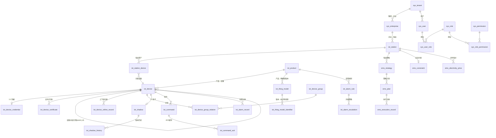

# 深圳三多能源储能管理平台 — Phase 2 数据库设计

> 阶段目标：完成 MySQL / TDengine / Elasticsearch / Redis / Kafka 五套存储的详细设计，输出 DDL 脚本。
> 本阶段不写 Java 代码，产出设计文档 + DDL 脚本，作为 Phase 3 后端工程初始化（Flyway）的权威依据。

| 项目 | 内容 |
| --- | --- |
| 阶段 | Phase 2：数据库设计 |
| 版本 | v1.0 |
| 日期 | 2026-08-06 |
| 输入依据 | Phase1 §1.2 容量模型、§5 服务拆分、§7.1 Topic、§13 目标；ADR-002/005/006/007/008/009 |

---

## 1. 概述与容量输入

| 指标 | 目标值 | 对存储的约束 |
| --- | --- | --- |
| 100 万设备在线 | 设备树/凭据/影子按 device_id 分片 | MySQL 分表 |
| 上行 20万~50万 msg/s | 时序写入必须宽表低放大 | TDengine 每产品宽表 |
| 时序 500 万 points/s | 写入吞吐与降采样 | TDengine 多副本 + vgroups |
| 控制链路 P99 ≤ 500ms | 命令状态机低延迟 | Redis 命令队列/inflight |
| 告警 ≤ 3s | 规则 → 记录 → ES/通知 | ES 冷热分层 |

存储职责边界（ADR-005）：
- **MySQL 8**：业务权威数据（组织/产品/设备/影子/命令/告警/策略），分库分表 + 分区
- **TDengine**：时序历史（属性/事件/电芯聚合/降采样），只存历史，不承担状态查询
- **Elasticsearch**：设备日志/操作日志/告警检索
- **Redis**：在线状态/影子热缓存/命令队列/认证缓存/Broker 会话/限流/锁
- **Kafka**：全链路消息总线（见 §5）

---

## 2. MySQL 8 设计

### 2.1 命名与类型公约

- **逻辑库**（ShardingSphere 数据源）：`es_system` / `es_product` / `es_device` / `es_shadow` / `es_command` / `es_alarm` / `es_ems` / `es_station`
- **表前缀**：`sys_`（系统/RBAC/审计）、`iot_`（产品/设备/影子/命令/告警/资产）、`ems_`（策略/电价/约束）
- **主键**：`BIGINT`；生产雪花 ID，本地 DDL 用 `AUTO_INCREMENT`（见 00_init.sql 头注）
- **索引命名**：`uk_`（唯一）、`idx_`（普通）
- **类型**：功率/容量 `DECIMAL(12,3)`、电价/金额 `DECIMAL(18,4)`、时间 `DATETIME(3)`（UTC）、文本 `utf8mb4`、长载荷 `JSON`、状态 `TINYINT`、乐观锁 `INT`
- **公共字段**：`create_by/create_time/update_by/update_time/deleted`（软删）

### 2.2 分库分表边界（对齐 ADR-006）

| 域 | 分库键 | 分表键 | 说明 |
| --- | --- | --- | --- |
| device | tenant_id | device_id hash 16 表 | 单设备读写同分片 |
| shadow | tenant_id | device_id hash 16 表 | PK=分片键 |
| command | tenant_id | device_id hash 16 表 | 同设备指令串行 |
| alarm/sys | — | 时间按月原生分区 | `iot_alarm_record`/`sys_operator_log`/`iot_command_ack`/`iot_device_online_record` |
| product/ems/station | — | 单逻辑库 | 读多写少，Redis 缓存 |

> 分片键不可变：`device_id` 注册后不可变更，否则历史数据无法路由。

### 2.3 ER 图（核心关系）

### 2.4 按域表目录

| 域 | 表 | 核心职责 | 分片 |
| --- | --- | --- | --- |
| system | `sys_tenant` | 租户（集团）+ 配额 | 行级 |
| | `sys_enterprise` | 企业组织树（parent_id+path） | 行级 |
| | `sys_user` / `sys_role` / `sys_user_role` / `sys_permission` / `sys_role_permission` | RBAC 五件套 | 行级 |
| | `sys_operator_log` | 操作审计，**按月分区** + 冗余 ES | 时间分区 |
| product | `iot_product` / `iot_product_category` | 产品 + 品类 | 单库 |
| | `iot_thing_model` | 物模型 JSON 整行快照（版本化） | 单库 |
| | `iot_thing_model_identifier` | 标识符投影（TDengine 列映射/校验白名单） | 单库 |
| device | `iot_device` | 设备主表（统一设备树，邻接表+path） | device_id hash |
| | `iot_device_credential` | 设备凭据（独立安全） | device_id hash |
| | `iot_device_certificate` | TLS 证书 | device_id hash |
| | `iot_device_online_record` | 上下线记录，**按月分区** | 时间分区 |
| | `iot_device_group` / `iot_device_group_relation` / `iot_device_tag` | 分组/标签 | device_id |
| shadow | `iot_shadow` | reported/desired 双 JSON + version 乐观锁 | device_id hash |
| | `iot_shadow_history` | 关键变更快照 | device_id |
| command | `iot_command` | Command Center 状态机全字段 | device_id hash |
| | `iot_command_ack` | 原始 ACK，**按月分区** | 时间分区 |
| alarm | `iot_alarm_rule` / `iot_alarm_escalation` | 规则 + 升级策略 | 单库 |
| | `iot_alarm_record` | 告警记录，**按月分区** + 冗余 ES | 时间分区 |
| ems | `ems_strategy` / `ems_plan` / `ems_execution_record` | 策略/计划头/执行审计 | 单库 |
| | `ems_electricity_price` | 分时电价 | 单库 |
| | `ems_constraint` | 安全约束（下发包络校验） | 单库 |
| station | `iot_station` / `iot_station_device` | 电站资产 + 设备关联 | 单库 |

### 2.5 关键建模决策

**决策 A.3.1 · 设备树统一建模，电芯不建表**
储能柜/簇/PCS/BMS/EMS 全部落在 `iot_device` 单表，用 `parent_id + path + level` 表达层级；电站独立建 `iot_station` 作资产根。**电芯不建 MySQL 表**：单柜数百电芯 × 百万设备 = 亿级行爆炸，且电芯无独立生命周期/影子/命令，不构成"设备"；单体数据由 BMS 聚合成极值/压差/温差等聚合属性上报，明细走 TDengine `st_cell_agg` 按 `cell_no` 打标签。

**决策 A.3.2 · 物模型 JSON 整行快照 + 标识符投影**
物模型是低频读写的配置文档，一条产品一个 Schema，天然适合 MySQL `JSON` 列整行版本快照（对齐 ADR-008）；拆子表会违背"新设备类型免发版接入"。`iot_thing_model_identifier` 是**降级索引**而非本体，用途：TDengine STABLE 列映射、identifier 检索、上报校验白名单。

**决策 A.3.3 · 影子双 JSON + 版本乐观锁**
`reported`（设备上报）/ `desired`（平台期望）同列存储；更新走 `UPDATE ... SET version=version+1 WHERE version=?`（ADR-007）。MySQL 为权威源，Redis 为热缓存（ADR-005）。

**决策 A.3.4 · 命令状态机全字段落表**
`iot_command` 状态映射 CREATED/SENT/DEVICE_RECEIVED/EXECUTING/SUCCESS/FAILED/TIMEOUT，各状态时间戳齐备；`idx(state, create_time)` 支撑超时扫描；`command_id` 全局唯一为业务幂等锚点（ADR-009）。

---

## 3. TDengine 时序模型

### 3.1 选型论证：每产品一张宽表 STABLE

| 方案 | 写入放大 | 查询 | 结论 |
| --- | --- | --- | --- |
| **每产品宽表**（列=产品属性） | 1 条消息=1 行，500万 points/s 下最优 | 设备视角全属性一次取回 | **采用** |
| 每指标一表 | 10~30 属性=10~30 行，**放大 10~30 倍** | 跨属性 union，代价高 | 否决 |

储能产品属性数量 < 200（远低于单表列上限）；新增属性随物模型版本演进触发低频 `ALTER STABLE ADD COLUMN`。极端多列场景（电芯数百点）不混入宽表，走 `st_cell_agg` 聚合表。

### 3.2 库与超级表

| 库 | 保留 | 超级表 | 说明 |
| --- | --- | --- | --- |
| `iot_tsdb_raw` | 365d | `st_prop_{productKey}` | 属性宽表，子表=device_id，tags=device_id/station_id/enterprise_id/product_key |
| | | `st_cell_agg` | 电芯聚合，tags 含 cell_no |
| `iot_tsdb_event` | 30d | `st_event` | 事件统一表，payload 用 JSON 列 |
| `iot_tsdb_agg` | 1825d | `st_prop_{1m,1h}_{productKey}` | 降采样宽表，连续查询写入 |

### 3.3 标签体系与子表

- 子表名 = `device_id`（一设备一子表），自动建表（`INSERT ... USING st TAGS(...)`）
- TAGS 4~5 个，低于 TDengine 建议上限 10；冗余 `station_id/enterprise_id/product_key` 便于跨产品/跨站聚合
- 设备在线状态**不落 TDengine**（影子/Redis 职责），TDengine 只存历史时序与事件

### 3.4 容量规划（时间线 + vnode）

- 时间线估算：每设备 ≈ 属性子表 + 事件子表 + 降采样子表 = 3~4 条 → **100 万设备约 400 万条时间线**
- vnode 规模：32 vgroup × 副本 2 ≈ 64 vnode，建议数据节点 **6~9 台**
- 扩容触发：节点 CPU/内存 > 70% → 增数据节点 + VGROUPS 在线调大 + 自动再平衡（对照 Phase1 §9）

### 3.5 降采样

`CREATE CONTINUOUS QUERY` 将原始宽表按 `INTERVAL(1m/1h)` 聚合写入 `iot_tsdb_agg`（见 `sql/tdengine/20_sample_stable.sql` §5）。

---

## 4. Elasticsearch 设计

| 索引 | 来源 | 核心字段 | 保留 |
| --- | --- | --- | --- |
| `es-device-log` | 设备日志/原始报文追踪 | device_id/product_key/level/code/message/extra/trace_id | 180d |
| `es-operator-log` | `sys_operator_log` 冗余 | operator/action/target/detail/trace_id | 180d |
| `es-alarm-log` | `iot_alarm_record` 冗余 | alarm_event_id/rule_code/level/status/message | 180d |

- 模板按 `es-*-log-*` 索引模式，ILM `es_log_policy`：**hot**（近 30d，SSD，rollover 30GB/1d）→ **warm**（30~180d，forcemerge+shrink 到 1 片）→ **delete**（180d）
- mapping 全部 `dynamic: false` + 显式字段，防字段爆炸；`extra/detail` 用 `object.enabled` 保留原始 JSON 语义

---

## 5. Kafka Topic 定稿（15 个）

| Topic | Key | 分区 | 保留 | 消费组 | 幂等语义 |
| --- | --- | --- | --- | --- | --- |
| `iot-raw` | messageId | 24 | 24h | trace | 生产端幂等 |
| `iot-thing-property` | deviceId | 48 | 7d | tsdb-writer / shadow-updater / rule-engine / ws-pusher / ai-feature | 生产幂等 + 影子乐观锁 + TDengine dedup |
| `iot-thing-event` | deviceId | 24 | 30d | alarm / rule-engine | 同属性 |
| `iot-device-lifecycle` | deviceId | 24 | 7d | device / shadow | 幂等 |
| `iot-command-down` | deviceId | 24 | 7d | access-adapter | 消费幂等（commandId） |
| `iot-command-ack` | commandId | 24 | 30d | command | 状态机守卫 |
| `iot-alarm` | deviceId | 12 | 30d | notify / ws-pusher | 幂等 |
| `iot-shadow-delta` | deviceId | 24 | 7d | access-adapter / ws-pusher | 幂等 |
| `ems-plan` | stationId | 12 | 30d | command / report | 幂等 |
| `iot-audit` | operatorId | 12 | 180d | log | 幂等 |
| `mqtt.router` | topic | 24 | 1h | broker 节点 | 跨节点投递去重（sourceNode+packetId） |
| `iot-device-register` | deviceId | 24 | 7d | device / log | 幂等 |
| `iot-log` | deviceId | 24 | 7d | log（→ES） | 幂等 |
| `iot-ai-feature` | deviceId | 24 | 7d | ai-feature | 幂等 |
| `iot-notify` | notifyTarget | 12 | 7d | notify | 幂等 |

要点：
- `iot-thing-property` 与 `iot-command-down` 均按 `deviceId` 分区 → 同设备消息串行，控制类指令不乱序（ADR-009）
- `iot-command-ack` 按 `commandId`（单指令独立，无需同设备串行）
- 生产端 `enable.idempotence=true + acks=all + min.insync.replicas=2`；消费端手动提交 + 重试 topic + DLQ（Phase1 §7.3）

---

## 6. DDL 脚本归属与 Flyway 映射

| 脚本 | 归属服务 | 加载方式 |
| --- | --- | --- |
| `sql/mysql/00_init.sql`~`80_station.sql` | 各域服务 | Phase 3 迁移到 `backend/energy-*/src/main/resources/db/migration/V1__*.sql`，由各服务自身 **Flyway** 管理（system 管 sys_*、product 管产品/物模型、device 管设备域……） |
| `sql/mysql/sharding/` | deploy | ShardingSphere **不自动建表**，由 `deploy/scripts/init-sharding.sh` 生成物理分表 |
| `sql/tdengine/*` | energy-tsdb | TDengine 无 Flyway，由 energy-tsdb 启动时执行 |
| `sql/elasticsearch/*` | energy-log / energy-alarm | 服务初始化时 PUT template + ILM policy |

---

## 7. 评审清单

- [ ] MySQL 六类表齐备（组织/产品/设备/凭据拓扑/物模型/策略告警指令审计），ER 图覆盖关键关系
- [ ] TDengine 宽表选择与理由明确，tags/子表/保留/降采样/vnode 齐备
- [ ] ES 3 类索引 mapping + ILM 齐备
- [ ] Redis key 覆盖 Broker 全部 `mqtt:*` + 影子/命令/限流/锁（见 `Redis-key规范.md`）
- [ ] Kafka 15 topic 定稿，含 `mqtt.router`，与 Phase1 §7.1 一致并补齐
- [ ] DDL 脚本可由 Phase 3 的 Flyway/初始化程序直接引用

## 8. 下一阶段任务（Phase 3：后端工程初始化）

1. Maven 多模块父工程（Java17 / Spring Boot 3.x / Spring Cloud Alibaba），依赖版本统一管理
2. `energy-common` 基础设施（统一返回/异常/工具/幂等/锁）
3. 各服务骨架 + Nacos/Gateway/OpenFeign 集成 + Sentinel
4. `deploy/docker/` 本地依赖环境（MySQL/Redis/Kafka/ES/TDengine/Nacos）+ 初始化数据加载（引用本阶段 DDL）
5. Flyway 迁移脚本就位（按 §6 映射）
6. 冒烟启动 gateway + 任一业务服务，验证数据源连通与建表
