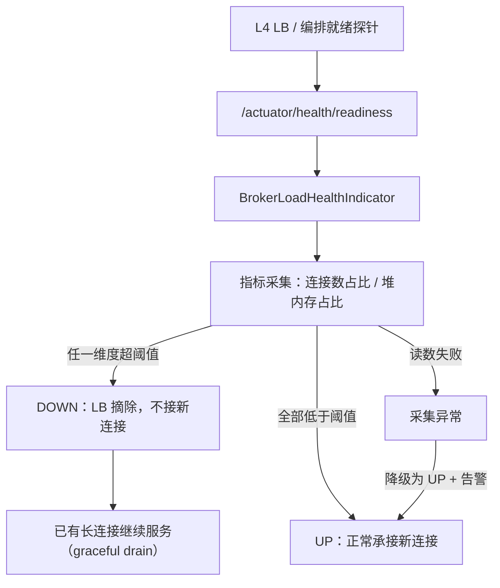
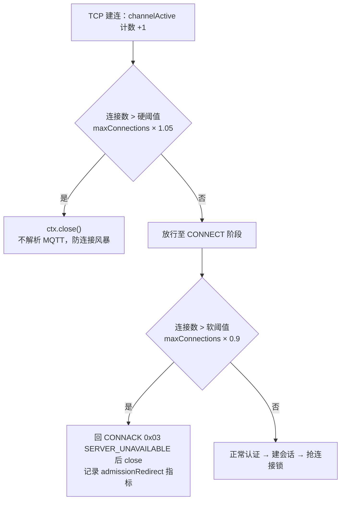

# Broker 连接数过载处置：过载探针 + 双阈值准入 + 重连抖动

> 日期：2026-09-03 ｜ 状态：待实施
> 决策记录（brainstorming 已确认）：
> ① 目标形态 = **预留接口 + 单机可验证**，LB/K8s 配置只出文档与样例；
> ② 交付范围 = 过载探针 / 拒绝语义 / SDK 抖动 / 部署硬化 / 阈值实测 **四项全做**；
> ③ 拒绝语义 = **双阈值**（软 0.9 回 CONNACK 0x03、硬 1.05 直接 close）。

---

## 一、问题

设备连接数超过单节点上限被拒后，设备退避重连，**落点仍由外部 LB 决定**，很可能再次落到同一个已满的节点，形成"拒绝 → 重连 → 再被拒"的循环。

**三个根因**：

1. **拒绝时没给出去向**：`MqttChannelInboundHandler:187-194` 在 TCP 层 `ctx.close()`，设备收不到任何应用层响应。
2. **LB 盲选落点**：节点不上报负载，LB 无从感知。
3. **节点间无负载视图**：`mqtt:node:{nodeId}` 只存存活标记，不存负载。

**关键前提（架构硬约束）**：设备端只认**一个域名**，背后是 L4 LB，设备既看不到也选不了具体节点。因此**落点决策权在 LB，不在设备端**——凡是"让设备选节点"的方案（SDK 持多地址、设备端节点黑名单、分配服务返回内网 IP）一律不成立，Server Reference（MQTT v5 属性 0x9C）的定位是**跨接入点容灾**，不是集群内引流。

**当前部署缺口**：仓库内**尚无 LB 角色**（`deploy/scripts/start-stack.sh` 为单实例脚本直启），故本设计以"Broker 侧能力 + 预留接口"为交付边界，LB 配置以文档样例给出，等基础设施到位即可生效。

## 二、现状代码事实（实证）

| 项 | 现状 | 位置 |
|---|---|---|
| 连接数准入 | `channelActive` 超 `maxConnections=500000` → `ctx.close()`，**不发 CONNACK** | `MqttChannelInboundHandler:187-194` |
| 阈值配置 | `max-connections: 500000` | `application.yml:64`、`BrokerProperties:50` |
| 健康端点 | 已暴露 `prometheus,health,info`，且 `probes.enabled: true`（readiness/liveness 已分离） | `application.yml:117-125` |
| 健康指示器 | **零自定义 HealthIndicator**，过载不会让 health 变 DOWN | 全模块 grep 无命中 |
| 部署形态 | 单实例脚本直启，就绪端口 1883；**无 LB / 无 K8s / 无 nginx stream** | `start-stack.sh:33-38` |
| JVM 参数 | 启动脚本**未设 -Xmx**，走 JVM 默认（物理内存 1/4） | `start-stack.sh` |
| SDK 退避 | `min(backoffMs × 2^min(attempt,5), maxBackoffMs)`，**纯指数无抖动** | `sdk/java/.../MqttDevice.java:433-436` |
| 限流态存储 | 全部节点本地内存，无跨节点共享（连接数/认证并发/发布限速/背压） | 既有审计结论 |

**阈值形同虚设**：50 万不是实测值。fd（`ulimit -n`）、内存（每连接几十 KB × 50 万 = 十几 GB，且未设 -Xmx）、CPU（心跳检测 O(n) 定时任务）三道墙会先到，真来连接风暴是先 fd 耗尽或 OOM 挂掉，而非优雅拒绝。

## 三、目标与非目标

**目标**

- G1：过载时节点能**主动对外声明不接新客**（readiness DOWN），且**不断开已有连接**。
- G2：被拒设备能**区分"服务器满"与"网络故障"**，从而采用正确的退避策略。
- G3：重连时刻**打散**，避免同步回撞形成周期性尖峰。
- G4：`maxConnections` 有**实测依据**，而非拍脑袋的 50 万。

**非目标（明确排除）**

- 主动 rebalance 的**实现**不在本次范围，且**优先复用 LB 能力**（腾讯云「存量连接重调度」等，机制见附录 A）而非自研；Redis 全局配额、一致性哈希环属后续集群化阶段。
- 更改设备接入地址模型（维持单域名）。
- LB / K8s 实际配置落地（只出文档样例）。

## 四、架构与数据流

### 4.1 过载判定与摘除



### 4.2 双阈值准入决策



## 五、详细设计

### 5.1 过载探针（新增 HealthIndicator）

新增 `backend/energy-mqtt-broker/src/main/java/com/energyx/broker/stats/BrokerLoadHealthIndicator.java`，实现 `HealthIndicator`。

**判定维度（第一版仅两项，均为确定可得的数据）**：

| 维度 | 数据源 | 阈值配置项 | 默认 |
|---|---|---|---|
| 连接数占比 | `rawConnections / maxConnections` | `soft-connection-ratio` | 0.9 |
| 堆内存占比 | `Runtime.totalMemory()-freeMemory() / maxMemory()` | `max-heap-ratio` | 0.85 |

连接数占比**复用** `soft-connection-ratio`（与 §5.2 双阈值准入的软阈值同一数值）：语义一致——超过该比例的节点既对外声明不接新客（readiness DOWN），万一仍有新连接到达也回 CONNACK 0x03。

`down()` 时通过 `withDetail()` 回填各维度实测值与阈值，便于运维一眼定位是哪个维度触顶。

**装配（关键，见 §7 坑 1）**：

```yaml
management:
  endpoint:
    health:
      group:
        readiness:
          include: readinessState,brokerLoad
```

`include` 会**覆盖**默认成员，必须把 `readinessState` 一并写回，否则 readiness 组只剩自定义指示器。

**不采集 EventLoop 延迟 / pending 水位**：二者需要额外的可观测性基础设施当前未确认具备，第一版不做，列为第二阶段扩展项。

### 5.2 双阈值准入

| 阈值 | 触发位置 | 行为 | 目的 |
|---|---|---|---|
| 硬 `hard-connection-ratio=1.05` | `channelActive` | `ctx.close()`，不解析 MQTT | 连接风暴时保命 |
| 软 `soft-connection-ratio=0.9` | `handleConnect`（置于 `authSlots.tryAcquire` **之前**） | 回 `CONNACK 0x03` 后 `channel.close()` | 可诊断、省下认证开销 |

**计数契约（不得破坏）**：既有修复已确立「`channelActive` 只增、`channelInactive` 统一减」，拒绝分支**严禁**手动 decrement —— 否则与 `channelInactive` 的扣减叠加，计数持续负偏移导致准入逐步失效。回归测试 `ConnectionAdmissionCounterTest` 覆盖此契约。

**指标**：`BrokerStats` 新增 `admissionRedirect`（软拒计数）；既有 `rejectedConnections` 语义收敛为**硬拒计数**，Javadoc 中明确二者区别，避免运维误读。不新增 `admissionHardReject`，防止与 `rejectedConnections` 语义重叠导致重复计数。

### 5.3 SDK 重连抖动

`sdk/java/src/main/java/com/energyx/device/MqttDevice.java:433-436`：

```java
long capped = Math.min((long) config.reconnectBackoffMs() * (1L << Math.min(attempt, 5)),
        config.reconnectMaxBackoffMs());
// 半随机抖动：保留一半基准退避，另一半随机，打散集群内设备的重连时刻
long delay = capped / 2 + ThreadLocalRandom.current().nextLong(capped / 2 + 1);
```

`capped=0` 时 `nextLong(1)` 返回 0，无除零风险。`ThreadLocalRandom` 无争用，优于共享 `Random`。

### 5.4 部署参数硬化

`deploy/scripts/start-stack.sh` 中 broker 启动命令补：

- `-Xms/-Xmx`：显式设定堆上限，避免走 JVM 默认（物理内存 1/4）导致 OOM 先于优雅拒绝。
- `ulimit -n`：启动前提升文件句柄上限，使 fd 不再早于内存成为第一道墙。

具体数值在 §5.5 实测后回填；未实测前先按"堆上限 = 容器/机器内存的 60%、fd = 目标连接数 × 1.2"设置占位，并在脚本注释中标注需按实测调整。

### 5.5 阈值实测方法

工具：`test/sim-device/sim-device.sh`（造连接）、`test/stress/run-baseline.sh`（基线压测）、`/internal/broker/stats` 与 `/actuator/health/readiness`（读数）。

步骤：

1. 从低到高阶梯加压（如 1k → 5k → 1w → 5w → 10w 连接），每档稳定 3 分钟。
2. 每档记录：p99 心跳响应延迟、Full GC 停顿、堆占用、CPU、`/stats` 的 `backpressureParked`。
3. 找到 **p99 心跳延迟或 GC 停顿开始劣化的拐点**，取该拐点连接数的 **60~70%** 作为 `max-connections`。
4. 软/硬阈值按此值换算：`max-connections` 取拐点连接数，软阈值 = 该值 × 0.9，硬阈值 = 该值 × 1.05。

实测结果回填 `application.yml` 与 §5.4 的部署参数，并在本文档末尾补记「实测结论」小节。

## 六、改动清单

| # | 文件 | 改动 |
|---|---|---|
| 1 | `broker/stats/BrokerLoadHealthIndicator.java` | **新增**：过载判定 HealthIndicator |
| 2 | `broker/stats/BrokerStats.java` | 新增 `admissionRedirect` 计数器；`rejectedConnections` Javadoc 收敛为硬拒语义 |
| 3 | `broker/config/BrokerProperties.java` | 新增 `Overload` 内嵌配置（`softConnectionRatio` / `hardConnectionRatio` / `maxHeapRatio`） |
| 4 | `broker/handler/MqttChannelInboundHandler.java` | `channelActive` 硬阈值；`handleConnect` 软阈值回 CONNACK 0x03 |
| 5 | `broker/src/main/resources/application.yml` | 追加 `energyx.broker.overload.*` + `group.readiness.include` |
| 6 | `sdk/java/.../MqttDevice.java` | 退避加抖动 |
| 7 | `deploy/scripts/start-stack.sh` | 补 `-Xms/-Xmx`、`ulimit -n` |
| 8 | 本文档 | 回填实测阈值 |

## 七、关键决策与陷阱

**坑 1（致命）— 自定义 HealthIndicator 默认不属于任何 health group。**

`/actuator/health/liveness` 与 `/actuator/health/readiness` 是**分组端点**，默认成员分别只有 `livenessState` 与 `readinessState`；自定义指示器**只出现在聚合端点 `/actuator/health`**。若探针打在聚合端点，过载会让聚合 health DOWN，而大量编排系统把聚合端点当 liveness 用 —— **结果是过载节点被重启，几十万连接全部断开，自造一场灾难级重连风暴**。

对策（两条同时做）：① 显式挂进 readiness group 并写回 `readinessState`；② 文档钉死 **liveness 必须指向 `/actuator/health/liveness`，禁止使用聚合端点**。

**坑 2 — 软拒下沉到 CONNECT 阶段会在最扛不住的时候增加解码开销。**

故硬阈值必须保留且高于软阈值，形成"平时软拒可诊断、风暴时硬拒保命"的分层。软拒分支置于认证信号量之前，过载时不再消耗认证资源。

**坑 3 — 摘除 ≠ 断开。**

readiness DOWN 只应阻止**新连接**，绝不能触发已有连接断开。本设计不改动任何断连逻辑，drain 由 LB 侧的既有行为保证。

**坑 4 — 计数契约（既有 bug 已修，不得回退）。**

拒绝分支手动 decrement 会与 `channelInactive` 叠加导致计数负偏移、准入逐步失效。详见 §5.2。

## 八、错误处理与降级

| 异常场景 | 处理 |
|---|---|
| 指标读数异常（如 `Runtime` 调用失败） | 探针**降级为 UP**，打 WARN 并累加 `healthDegraded` 指标。**探针故障不该导致节点被摘**，可用性优先于准确性 |
| 软拒路径发 CONNACK 失败 | 回落到 `ctx.close()`，不因发报文失败而卡住连接 |
| 阈值配置非法（软 ≥ 硬，或 ratio ≤ 0） | 启动期校验失败快速失败（fail-fast），避免运行期行为不可预测 |
| 实测期间 OOM / fd 耗尽 | 属预期内的探索过程，记录该档位为拐点上界 |

## 九、测试策略

| 层 | 用例 |
|---|---|
| 单测 | `BrokerLoadHealthIndicatorTest`：连接数/堆内存各维度 UP-DOWN 边界；多维度"任一触顶即 DOWN"；读数异常降级 UP |
| 单测 | `ConnectionAdmissionCounterTest`（已有，扩展）：软阈值区间内 `channelActive` 不 close 且 CONNECT 阶段收到 CONNACK 0x03；硬阈值之上直接 close；**计数不双减**（契约回归） |
| 单测 | SDK 抖动：同一 attempt 多次采样，断言 `delay ∈ [capped/2, capped]` 且样本不全等 |
| 配置校验 | 软阈值 ≥ 硬阈值时启动失败 |
| 实测 | §5.5 阶梯加压，记录拐点 |

## 十、实施顺序与 commit 切分

采用**可观测先行**的串行顺序（探针先上，其数据反哺后续实测）：

| 步 | 内容 | commit |
|---|---|---|
| S1 | 过载探针（改动 1、2、3、5-配置部分） | `feat(broker): 新增过载就绪探针，过载时 readiness 转 DOWN 且不影响 liveness` |
| S2 | 双阈值准入（改动 4）+ 单测 | `feat(broker): 连接数准入改双阈值，软拒回 CONNACK 0x03` |
| S3 | SDK 退避抖动（改动 6）+ 单测 | `fix(sdk): 重连退避加随机抖动，防重连风暴同步回撞` |
| S4 | 部署硬化（改动 7）+ 阈值实测（改动 8） | `chore(deploy): 补 JVM 堆上限与 fd 限制；max-connections 按实测拐点取值` |

S3 与 S1/S2 零耦合，可并行插队。

## 十一、风险

| 风险 | 等级 | 缓解 |
|---|---|---|
| readiness 误挂到 liveness → 过载被重启 | **高** | §7 坑 1 双保险；S1 完成后人工核 `/actuator/health/liveness` 仍为 UP |
| 软拒解码开销放大连接风暴 | 中 | 硬阈值兜底；软拒置于认证前，省下认证开销 |
| 实测耗时超预期 | 中 | S4 与其他步骤解耦，延后不影响前序交付 |
| 阈值初值（0.9/1.05）不合身 | 低 | 配置化，实测后回填即可，无需改代码 |

## 十二、验收标准

1. `mvn -o test` 全模块绿（含新增 3 组单测），`spring-javaformat:validate` 通过。
2. 起单节点后：`/actuator/health/liveness` 恒为 **UP**；临时将 `max-connections` 调至个位数并连满，`/actuator/health/readiness` 转 **DOWN**，且聚合端点 `/actuator/health` 的 `brokerLoad` 明细含各维度实测值。
3. 过载期间**已有连接保持在线**（用一个已连接设备持续收发心跳验证），新连接被拒并收到 CONNACK 0x03。
4. SDK 抖动：同一 attempt 重复采样，延迟值分布不均等且落在 `[capped/2, capped]`。
5. 实测报告：阶梯加压各档位的 p99 心跳延迟 / GC 停顿 / 堆占用数据齐备，`max-connections` 已按拐点 60~70% 回填。

---

## 附录 A：LB 两道闸机制与设计纪律（勘定，防回退）

### A.1 机制

四层 LB 是**数据平面网关**，所有流量过它：每转发建立一条 TCP 连接，LB 就在本地连接表 +1，断开 -1 —— **各后端的活跃连接数是 LB 本地统计，不需要后端暴露**。`least_conn` / LVS `wlc` 读的就是这个本地计数器。

需要暴露的是「能否接新客」的**二态判断**：云/开源健康检查都只有 UP/DOWN 二态，不支持传阈值、不读负载数值；而「进程健康但连接数 90%」这类状态 LB 无从得知。因此把连续负载（连接数占比 / 堆内存占比）在应用侧判阈值、压成 HTTP 200/503 喂给 LB —— **用二态通道传递连续信息**。

新连接决策经过两道独立闸门：

1. **准入闸**：探 `/actuator/health/readiness`，DOWN 的节点不再接收新连接（LB 不消费数值，只消费布尔结果）。
2. **调度闸**：在存活节点中按 LB 本地连接数选最小（least_conn），纯 LB 本地计算。

### A.2 推论（实施纪律）

1. **两侧连接数对不上且别试图对齐**：LB 只数经过它的连接；broker 的 `rawConnections` 还包含直连流量，且存在关闭时序差（FIN/TIME_WAIT）与摘除后存量仍计数。两者互补——broker 自保护（软/硬阈值）用于覆盖 LB 摘除的 ~15s 探测延迟（如 5s 间隔 × 3 次失败），**不得因有 LB 而砍掉节点自保护**。
2. **长连接下 least_conn 收敛慢**：活跃连接数长期不降，新节点只能慢慢吸收新连接、存量不迁移。主动 rebalance **优先复用 LB 能力**（腾讯云「存量连接重调度」：触发于健康检查异常 / 权重置 0 / 解绑后端；K8s 靠 pod 驱逐重建），或过载节点分批带退避断开部分会话，**不推荐自研 LB 层逻辑**。
3. **后端权重是静态的**：动态权重需 sidecar 调云 API，一般无必要——readiness 二态摘除已覆盖大部分场景，剩余由 least_conn 承担。
4. **YAGNI 纪律**：本机制下「节点负载上报 Redis（连接数/CPU 写入共享存储）」**没有消费方**，禁止设计此类组件，除非未来出现真正的消费者（动态权重、跨节点 rebalance 决策）。

## 附录 B：生产部署配置样例（运维照抄，按实际网络替换 IP）

> 前置：Broker 多节点部署，每节点暴露 18831/8883（MQTT）与 8082（管理端点，含 `/actuator/health/liveness`、`/actuator/health/readiness`）。
> 通用约束：**纯 TCP 透传，不做 TLS 卸载**（保 mTLS CN=clientId 校验，TLS 落到 broker）；**空闲超时 > MQTT keepalive × 1.5**（监听器默认 900s 对应 keepalive ≤ 600s）。

### B.1 阿里云 NLB（必须 NLB —— CLB 无加权最小连接数）

- 监听：TCP，前端 18831（启用 TLS 时 8883），后端指向 broker 节点内网 IP。
- 服务器组调度算法：**加权最小连接数**。
- 健康检查：协议 **HTTP**，端口 **8082**，路径 `/actuator/health/readiness`，健康状态码 `http_2xx`。
- 连接优雅中断：**保持默认关闭**（关闭 = 存量连接不主动断，正是所需行为；开启反而会在超时后主动断开存量连接）。
- 客户端地址保持：**开启**（否则源 IP 全变成 LB IP，`auth-failure-ban-threshold` 按 IP 封禁会误伤共享源 IP 的全部设备）。
- 新建连接限速：可选，作为连接风暴的额外闸。
- 若不开地址保持，可改开 ProxyProtocol（broker 侧需支持解析，当前未实现，需另评估）。

### B.2 腾讯云 CLB 四层

- 监听器：TCP，均衡方式 **加权最小连接数（WLC）**。选 WLC 后不支持会话保持——MQTT 长连接会话已外置 Redis，无需会话保持。
- 健康检查：TCP 监听器选 HTTP 检查方式，`checkPort: 8082`、`httpCheckPath: /actuator/health/readiness`、状态码期望 2xx。
- 存量连接重调度：**保持默认关闭**（关闭 = 健康检查异常时不 RST 存量连接）。
- 源 IP：四层监听器**默认透传**客户端真实 IP，无需额外配置。
- 可选：性能容量型的监听器最大连接数/新增连接数限速（MaxConn / MaxCps）。

### B.3 私有化 HAProxy + keepalived（自建四层，推荐组合）

```haproxy
# /etc/haproxy/haproxy.cfg —— 两台 HAProxy + keepalived VRRP 主备
global
    maxconn 200000
    nbthread 8
    ulimit-n 400000

defaults
    mode tcp
    timeout connect 5s
    timeout client  600s        # > MQTT keepalive × 1.5
    timeout server  600s
    timeout check   3s

frontend mqtt_in
    bind *:18831
    default_backend broker_nodes

backend broker_nodes
    balance leastconn
    # HTTP 健康检查探 broker 管理端口 8082 的 readiness
    option httpchk GET /actuator/health/readiness HTTP/1.1
    http-check expect status 200
    server broker-1 10.0.1.11:18831 check port 8082 inter 5s fall 3 rise 2
    server broker-2 10.0.1.12:18831 check port 8082 inter 5s fall 3 rise 2
    server broker-3 10.0.1.13:18831 check port 8082 inter 5s fall 3 rise 2
```

- keepalived VRRP 承担虚拟 IP，杜绝 LB 单点。
- 源 IP：tcp mode 后端默认看到 HAProxy 地址；要透传可配 TPROXY（运维侵入大）或 `send-proxy`（broker 侧需支持解析 ProxyProtocol，当前未实现，需评估）。

### B.4 K8s（kube-proxy 必须 IPVS 模式）

- kube-proxy ConfigMap：`mode: "ipvs"`、`ipvs.scheduler: "lc"`、`ipvs.strictARP: true`（配 MetalLB 时）。**默认 iptables 模式只有随机分发，长连接分布不均，不可用**。
- 对外暴露：内部 ClusterIP + NodePort，或 MetalLB LoadBalancer。
- 探针（liveness 与 readiness 独立配置，过载只影响 readiness）：

```yaml
# Deployment 容器片段
containers:
  - name: mqtt-broker
    ports:
      - containerPort: 18831
        name: mqtt
      - containerPort: 8082
        name: mgmt
    livenessProbe:
      httpGet: { path: /actuator/health/liveness, port: 8082 }   # 只探进程本身，绝不检查依赖与负载
      periodSeconds: 15
      failureThreshold: 3
    readinessProbe:
      httpGet: { path: /actuator/health/readiness, port: 8082 }  # 过载在此 DOWN，摘除只挡新连接
      periodSeconds: 5
      failureThreshold: 3
    lifecycle:
      preStop:
        exec:
          command: ["sh", "-c", "sleep 10"]   # 等 endpoint 摘除传播到各 Node，避免终止窗口的流量打到将死 Pod
```

- Service `externalTrafficPolicy: Local` 保留源 IP；配 `podAntiAffinity` 让 Pod 均匀分布（防流量打到无 Pod 的 Node 被丢弃）。
- 滚动更新/缩容保护：PodDisruptionBudget + 足够大的 `terminationGracePeriodSeconds`（Broker `@PreDestroy` 已实现删心跳 + 释放连接锁，方向正确）。
- Node 内核调优：`net.netfilter.nf_conntrack_max`（按连接数目标，示例 100 万）、`net.ipv4.vs.timeout_established`（> keepalive × 1.5）、IPVS `conn_tab_bits=20`（≈100 万条连接表）。
- ⚠️ **上线前必须实测**：readiness DOWN 摘除后，用已连接设备持续收发心跳，验证存量连接不断（社区存在版本相关反例，勿只信文档）。
